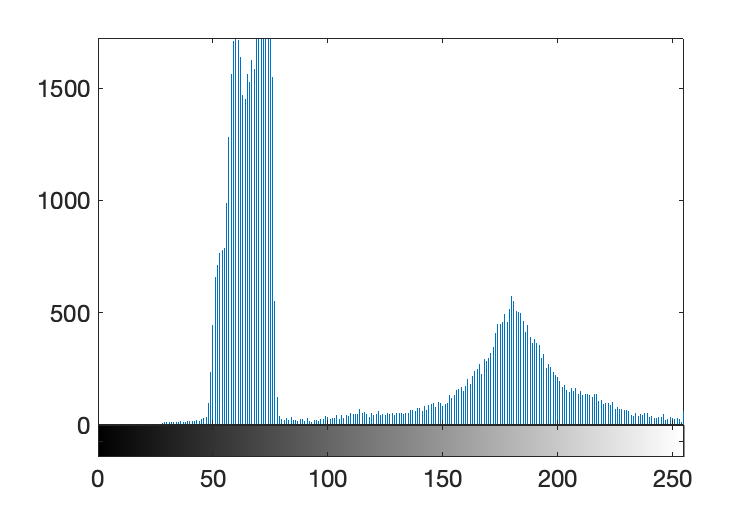

# Aims and Objectives

The aim of these exercises is to give you some fluency in handling images and video in Matlab.
In particular, you need to understand how to isolate and work with regions of interest in an image.

## Exercise 1

This lab will introduce images as handled by the Matlab programming language.
The most basic form of an image in Matlab is a matrix of unsigned 8-bit integers
and one of Matlab's great advantages is that it can read many of the standard image file formats.

Thus:

```{.matlab }
X = imread('cameraman.tif');
whos
```

reads in the image contained in the file `cameraman.tif`, which is one of
Matlab's standard images, and `whos` should return the dimensions of the image
and its stored size.
Most image file formats store a lot more data than just the pixel values.
The Tagged Image-File Format (TIF or TIFF) is particularly
rich -- try `imfinfo('cameraman.tif')` to see what other information is available.

You can display an image with:

```{.matlab }
imshow(X)
```

To explore the pixel values in more detail try:

```{.matlab }
imtool(X)
```

## Exercise 2

Colour images consist of three planes of data representing R, G and B respectively.

Thus:

```{.matlab }
C(:,:,1) = X;
C(:,:,2) = X;
C(:,:,3) = X;
whos
```

creates a colour image in which all three colour planes have identical values.
Before you `imshow(C)` try to guess what the new colour image will look like.

## Exercise 3

To demonstrate to yourself that this really is a colour image you may like
to alter the values in one of the planes, the red plane in this case:

```{.matlab }
Y = C;
Y(:,:,1) = uint8( 0.5 * double( C(:,:,1) ) );
imshow(Y)
```

What is the colour of the resulting image and why?

## Exercise 4

There are several alternative image representations including a matrix
of doubles (in which case 0 is black and 1 is white), binary images and indexed images.
Here is a double image:

```{.matlab }
Xd = double(X)/255;
whos
imshow(Xd)
```

Double images use up more storage than `uint8`s but are useful when
there is a need for a high precision in intensity (as in medical x-rays for example).

Binary images consisting of just two colours, black and white, are
represented by a data-type called `logical`.
For example, to convert $X$ to a binary image where pixels with an intensity
$\le99$ are set to $0$, and pixels $>100$ are set to $1$ you can type the following:

```{.matlab }
L = (X > 100);
imshow(L)
```

Binary images are important because they are the end result of many image
processing chains: binary images identify regions or masks.
Matlab's logical data type is irritatingly inefficient.

What is meant by this remark? (Hint: `whos`)

## Exercise 5

Practice to make sure you can convert between double and uint8
images and display them correctly (using `imshow`).
Note that they have different maximal values corresponding to white.

## Exercise 6

In lectures we mentioned the use of a histogram to describe the
distribution of pixel intensities within an image:

```{.matlab }
clear
X = imread('coins.png');
figure
imshow(X)
figure
imhist(X)
```

Your histogram should look something like that in Figure[@fig:hist].

{#fig:hist width=60%}

Looking at the histogram, can you work out how to segment the coins
from the background? Looking at the image dimensions, what is the sum of the
histogram bins? And how many pixels represent the coins?

Hint: to segment the coins from the background try `L = (X > thresh);`
where `thresh` is some suitably chosen threshold.
The sum of `L` represents the number of pixels that are above the threshold.

## Exercise 7

Binary images are very frequently used in machine vision and
Matlab has a set of commands for dealing with them.
Can you use `regionprops` to measure the radii of the circles?
One idea for lip-reading is to threshold the mouth region and compute features
such as height and width via `regionprops`.
(Note: If using this approach for the coursework you may find `bwlabel`
a useful tool for maintaining a consistent order of thresholded regions across video frames.)

## Exercise 8

Video is just a sequence of images but, without care, it is possible to
exhaust the physical memory of the machine when reading in a video.
For this reason, Matlab uses an object-oriented approach in which
video objects are accessed frame-by-frame.

```{.matlab }
v = VideoReader('xylophone.mp4');
vidHeight = v.Height;
vidWidth = v.Width;
s = struct('cdata',zeros(vidHeight,vidWidth,3,'uint8'),'colormap',[]);
```

which creates a video object, `v` and a data structure, `s`,
with two fields, `cdata` and `colormap`, to hold the movie data.

The movie can be read in as

```{.matlab }
k = 1;
while hasFrame(v)
    s(k).cdata = readFrame(v);
    k = k+1;
end
```

You can display the movie like this:

```{.matlab }
hf = figure;
set(hf,'position',[150 150 vidWidth vidHeight]);
movie(hf,s,1,v.FrameRate);
```

In practice it is rare to read in a full movie -- we usually work with individual
frames or collections of frames.

## Exercise 9

Thresholding need not be confined to greyscale images.
To see this use `imtool(s(1).cdata)} to look at the first frame in the video.
What are the pixel values associated with one of the yellow keys?
You can select the yellow key using

```{.matlab}
P = roipoly(s(1).cdata);
```

which brings up a figure window that enables you to click around the contour
of the yellow key (`help roipoly` for more information).
Try using `imshow` on the result, `P`.
To find the index positions of the pixels that were selected, you can use:

```{.matlab}
ptr = find(P);
```

We can compute the mean colour in the selected region of the original image as:

```{.matlab}
M1 = double(s(1).cdata);
R = M1(:,:,1);
G = M1(:,:,2);
B = M1(:,:,3);
cm = [mean(R(ptr)) mean(G(ptr)) mean(B(ptr))];
```

The mean R, G and B within the region you selected is stored in `cm`.
We can now measure the distance between every pixel and this mean colour and
threshold on one standard deviation of the distance.

```{.matlab}
D = sqrt((M1(:,:,1) - cm(1)).^2 + (M1(:,:,2) - cm(2)).^2 + ...
              (M1(:,:,3) - cm(3)).^2);
L = D < std(D(:))
imshow(L)
```

Given that the lips are generally a slightly different colour to the face,
**especially if wearing lipstick**, can you see how early lip-reading systems
used colour and/or lipstick and/or colour markers attached to the face?

Is such a system viable for your assignment? If you think this approach
looks viable then you might also like to experiment with
`colorThresholder` which allows you to visualise colour
thresholds in various colour spaces.

## Exercise 10

Note that images are often larger than we need them to be so it is
commonplace to define a subregion via:

```{.matlab}
roirect = getrect;
cimg = imcrop(X,roirect);
```
