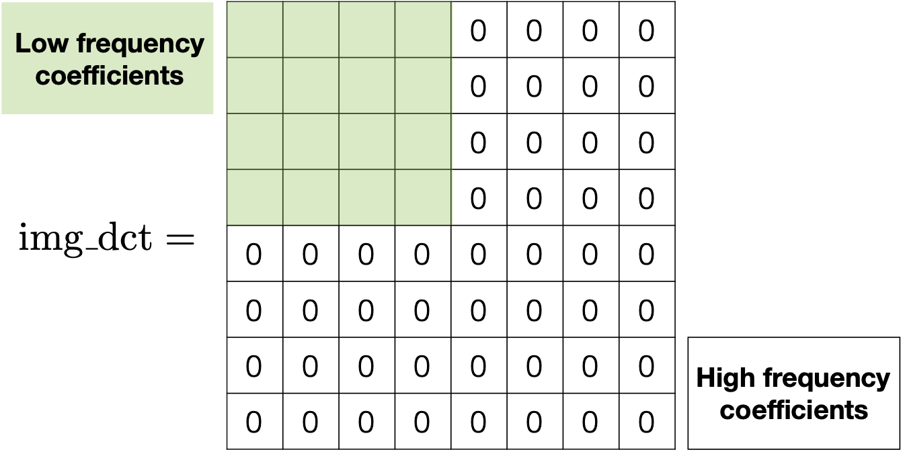

# Aims and Objectives

This laboratory session will introduce 2D DCT for coding images.
2D DCT forms a fundamental part of JPEG compression and can also be used to
extract features from an image for lipreading.
Prior to beginning this laboratory sheet, you are strongly
encouraged to complete the previous laboratory sheets.
Be sure to complete all of the exercises, and try to understand the purpose
and result of each exercise rather than simply entering the Matlab commands provided.

## Exercise 1

Load in _cameraman.tif_ and calculate the 2D DCT using the following code:

```{ .matlab}
img = imread('cameraman.tif');
img_dct = dct2(img);
```

The result, `img_dct`, is a matrix the same size as the image where the
top left element is the DC (zero-frequency) component and entries with
increasing vertical and horizontal index values represent higher vertical
and horizontal spatial frequencies. Recall that, in natural images,
the DCT coefficients corresponding to high frequencies tend to be very small.

You can confirm that this is true for your image by visualising the output:

```{ .matlab}
imshow(log(abs(img_dct)), [], 'colormap', jet(64))
```

This suggests that we may be able to simply omit these (zero out the coefficients)
without significantly affecting the perceived quality of the image.

Try removing the high frequency coefficients by keeping the top left
corner intact while setting the remaining DCT coefficients to zero as
illustrated in Figure[@fig:dct].

{#fig:dct width=50%}

```{ .matlab}
img_new = idct2(img_dct_trunc); % img_dct_trunc: truncated DCT matrix

% plot the original image and the reconstructed version
imshow(img, []);
figure;
imshow(img_new, []);
```

Discuss any interesting findings with a TA.

## Exercise 2

Write a function to retain an upper left triangular region of the DCT coefficient matrix, while zeroing out the remaining coefficients.

## Exercise 3

So far, the frequency components are computed from the entire image.
It is more typical in image coding to compute the frequency components from a
more localised area --- usually in $8 \times 8$ non-overlapping blocks of pixels.

Doing this will help to ensure that the local energy is more focussed in the
lower frequencies, and so the higher frequency components can be more
aggressively clipped with less impact on the image quality.

Write a function that takes an image as an input parameter, divides the image
into $8 \times 8$ blocks and computes and returns the DCT coefficients
for each block. You can either write the code for dividing up the image into
blocks, or you can look at using the \emph{blockproc} function.

As done previously, experiment with removing coefficients from the
bottom right of each block's DCT matrix, reconstruct the image and
compare it against the original image.

(Note: the non zero elements of the DCT blocks can be used to form a
feature vector for lipreading.)
