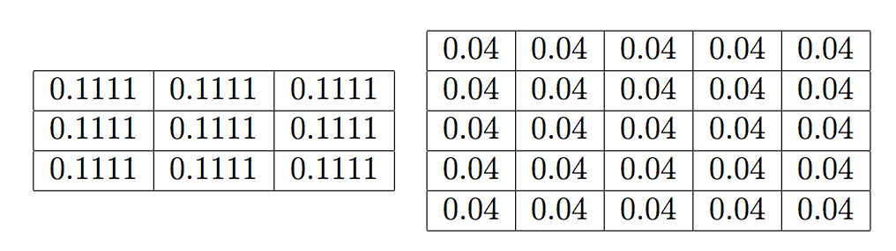
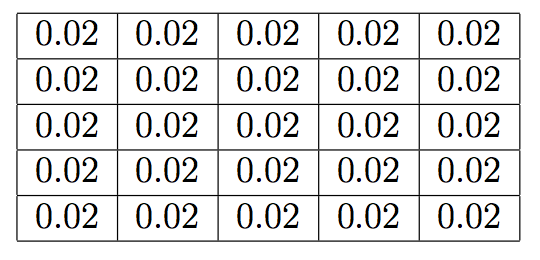

# Aims and Objectives

This laboratory session will introduce linear filtering of images.
Prior to beginning this laboratory sheet, you are strongly encouraged to complete
the previous laboratory sheets. Be sure to complete all of the exercises, and
try to understand the purpose and result of each exercise rather than simply
entering the Matlab commands provided.

## Exercise 1

Write a Matlab function that receives two input arguments: an image
(either greyscale or colour) and a filter kernel. Your function should
filter the image using the given kernel and return the filtered image.
Recall, a spatial-domain image filter is defined by a 2D convolution

$$g(x,y) = \sum_{m=-a}^{a}\sum_{n=-b}^{b}f(x-m,y-n)h(m,n)$$

Test your function by filtering various images with the following filter
kernels. Before applying the filters, what do you expect the affect of these
filters to be? Why? What do you expect to be the difference in the result
for the two given kernels?

{width=70%}

**Note:** you might want to think carefully about the data types you are working
with inside your function, and you will need to worry about the pixels at the
image edges. At the image edge, the filter kernel extends beyond the image
bounds, so there are missing data in the local neighbourhood. To overcome this,
one solution is simply to replicate the border pixels as many times as required.

## Exercise 2

The filter kernels used previously have all positive coefficients, and
the coefficients sum to unity. What can you say about the filter if the
coefficients are all positive? Assume the coefficients did not sum to
one --- what effect would this have on the image?
Test using the following kernel.

{width=35%}

What do these coefficients sum to? What is the effect on the image compared
with the same sized kernel with all coefficients equal to 0.04?

## Exercise 3

The behaviour of all 2D linear (image) filters is completely defined
by the coefficients in the kernel, regardless of the filter type.
The application of the filter is exactly that shown in Equation 1.

Matlab provides convenient functions for designing and applying image filters.
In particular look at the `fspecial` and `imfilter` functions.

The `fspecial` function provides a means for constructing filter kernels for many
different filter types, including: low-pass filters (box, Gaussian), edge-based
filters (Laplacian, Laplacian of Gaussian, Sobel, etc.) and other effects
(e.g. motion blur, unsharp masking). The `imfilter` function will
then apply the kernel to an image, where the desired behaviour at the image
borders can be specified.

Investigate the effect of the different parameters for the various filters
returned by `fspecial`.
