# Content

- DCT Features
- Eigenfaces
- Appearance Models
- Visual Feature Efficacy
- Model Fusion

## Image-based Features

The main limitation of shape-only features is there is a lot of information missing.

::: incremental

- Modelling only lip-shape discards information about the teeth and tongue for example.
- Why not use the full _appearance_ of the face?

:::

# DCT Features

## Discrete Cosine Transform (DCT)

Performs a similar function to DFT in that it transforms a signal (or image) from the spatial domain to the frequency domain.

- The difference is that it only considers the real-valued cosine components of the DFT.
- We can compact the energy of the signal into the low frequency bins.
- Used in JPEG compression.
- First proposed by Nasir Ahmed in 1972.

## Review: DFT

{width=80%}

## DCT 1D

$$
X_k = s(k) ~ \sum_{n=0}^{N-1} x_n
cos \left[ \frac{\pi k (2n + 1)}{2N} \right]
$$

Where:

- $X$ is the DCT output
- $x$ is the input signal
- $N$ is the number of samples
- $k = 0, 1, 2, \dots, N-1$
- $s(0) = \sqrt{1/N}, ~ s(k \neq 0) = \sqrt{2/N}$

::: notes
MATLAB has the dct function
:::

---

### 8-Point 1-D DCT Basis

::: columns
::::: column
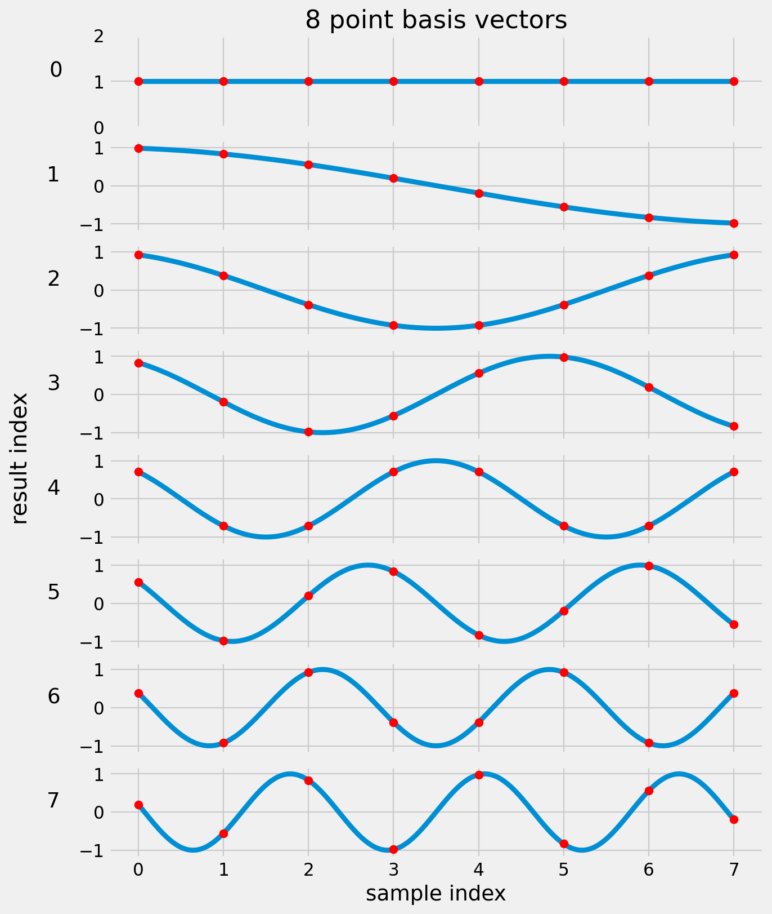

:::::
::::: column

$$Y_k = cos \left[ \frac{\pi k (2n + 1)}{2N} \right]$$

$$n = 0, 1, 2, \dots, N-1$$

:::::
:::

## DCT for 1D Signals

Let's look at one 8 x 8 block in an image.

---

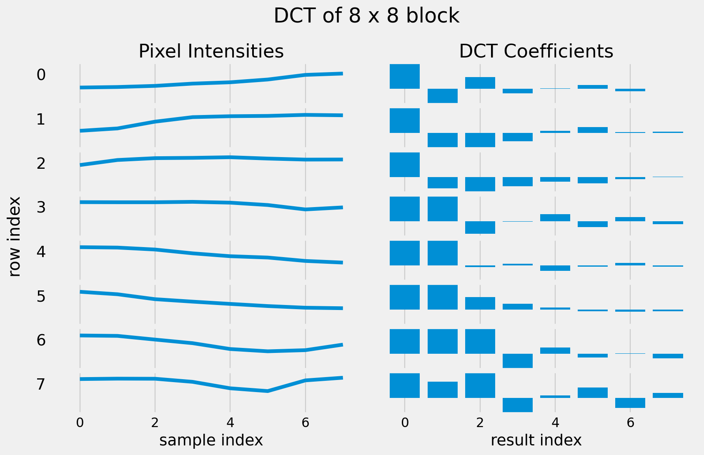

## DCT for 1D Signals

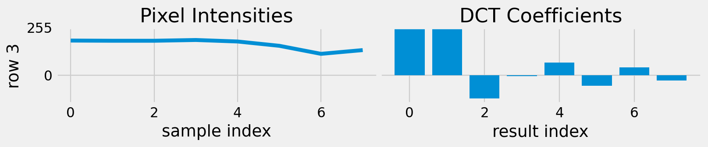

::: {.incremental}

- Most of the energy is concentrated in the low frequency coefficients.
- Images have less high frequency information.

:::

## DCT for 2D Signals

We have only considered vectors so far.

- Images are 2-dimensional (two spatial co-ordinates).
- Apply DCT to both rows and columns of the image.

::: {style="font-size:0.75em;"}

$$
X_{u, v} = s_u s_v ~ \sum_{x=0}^{N-1} \sum_{y=0}^{N-1} I(x, y) ~
    cos \left[ \frac{\pi u (2x + 1)}{2N} \right]
    cos \left[ \frac{\pi v (2y + 1)}{2N} \right]
$$

:::

## DCT for 2D Signals

::: columns
::::: column

:::::
::::: column

Rather than basis vectors, we have basis images.

:::::
:::

## DCT for 2D Signals

Let's look again at the same 8 x 8 block in an image.

## DCT for 2D Signals

Here is the 2D DCT of the block.

## DCT for 2D Signals

::: columns
::::: column

:::::
::::: column

Let's examine the actual values of the coefficients.

:::::
:::

## DCT for 2D Signals

::: columns
::::: column

:::::
::::: column

Notice that the most significant values congregate at the top left.

:::::
:::

## DCT for 2D Signals

::: columns
::::: column

:::::
::::: column

We can stack the top left values to make a feature vector.

$f = (972, 85, 19, -59, \dots)$

:::::
:::

## DCT for 2D Signals

::: columns
::::: column

:::::
::::: column

If we want to reconstruct the image using the inverse DCT, we can set the low values to zero to view the reconstruction loss.

:::::
:::

## DCT for 2D Signals

::: columns
::::: column

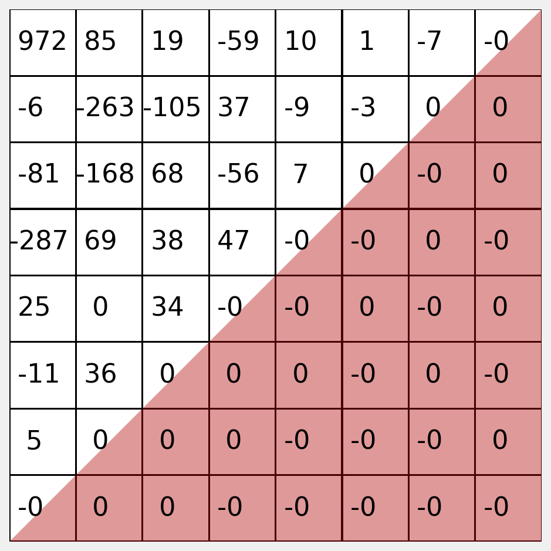

:::::
::::: column

Here you can see we have zeroed the lower right triangle.

You should decide empirically how many coefficients to retain.
Often, many fewer than half produce good results.

:::::
:::

## DCT Features {data-auto-animate="true"}

One approach for modelling the appearance of the face:

::: incremental

- Convert the image to greyscale.
- Crop the image to contain only the region of interest (the mouth).
- Normalise the size of the image to some default size (the images need the same number of pixels in each frame).
- Either resize the cropped regions, or better, use a constant clipping box.

:::

## DCT Features {data-auto-animate="true"}

One approach for modelling the appearance of the face:

::: incremental

- Segment the region into n x n pixel blocks.
- Experiment with $1 \leq n \leq 8$.
- Apply a 2D Discrete Cosine Transform (DCT) to each block.
- Extract coefficients that encode low frequency information.

:::

## 2D DCT case study

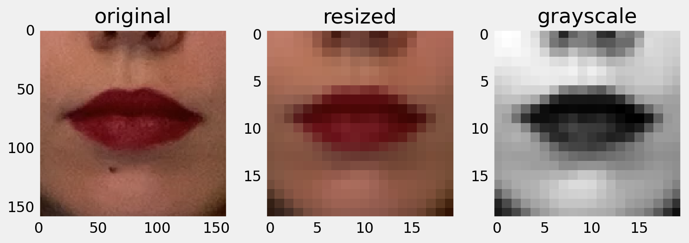

A region of interest is cropped, resized and converted to greyscale.

## 2D DCT case study

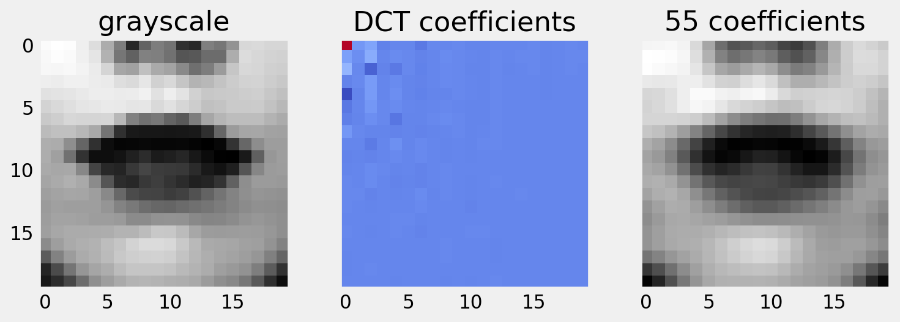

From the greyscale image, we can extract the DCT coefficients.
We retain only the low frequency coefficients, and show a reconstruction of the image.

## 2D DCT case study

Perceptual evaluations of the reconstruction are informative, but your experiments should determine how useful the features are for recognising speech.

# Eigenfaces

## Eigenfaces {data-auto-animate="true"}

::: incremental

- Crop the images to contain only the region of interest.
- Normalise the size of the image.
- Images need the **same number** of pixels in each frame.
- Resize the images, or better, use a constant clipping box.

:::

## Eigenfaces {data-auto-animate="true"}

::: incremental

- Apply **PCA** to the size-normalised images.
- When applied to face images, referred to as **Eigenfaces**.
- This was the basis of an early face recognition system. (Turk and Pentland, 1990).

:::

::: notes
Eigen faces is just a term - PCA has no understanding of the type of data being processed.
:::

## Eigenfaces {data-auto-animate="true"}

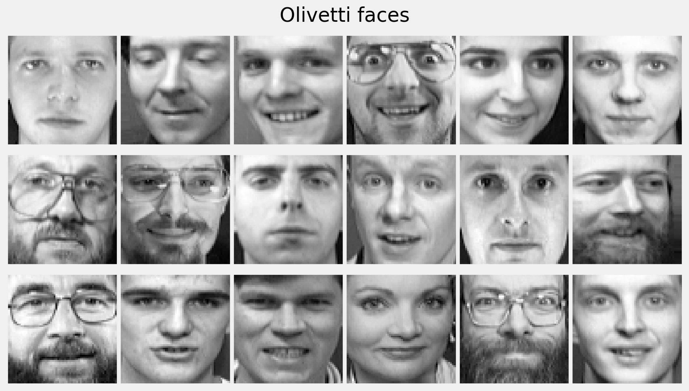

::: notes
The face data has been _crudely_ aligned - meaning the major features, eyes nose, mouth etc are in corresponding locations in each image.
The images are 64px square in this case.
:::

## Eigenfaces {data-auto-animate="true"}

Recall, to reconstruct using PCA:

$$\mathbf{x} \approx \mathbf{\overline x} + \mathbf{P} \mathbf{b}$$

## Eigenfaces {data-auto-animate="true"}

A human face can be approximated
from the mean shape plus a linear combination
of the eigenfaces.

## Eigenfaces {data-auto-animate="true"}

{width=50%}

## Eigenfaces {data-auto-animate="true"}

## Eigenfaces {data-auto-animate="true"}

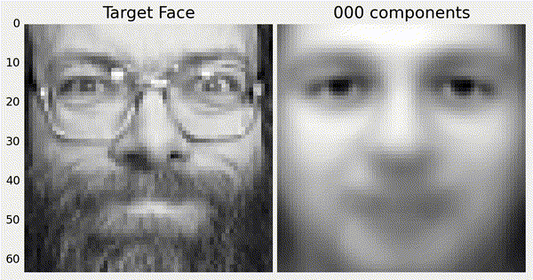{width=90%}

::: notes
I feel this is quite impressive to be able to reconstruct a decent face from 150 or so parameters.
:::

# Appearance Models

## Appearance Models {data-auto-animate="true"}

There is problem with the Eigenface approach:

::: incremental

- There are _two_ sources of variation - shape **and** appearance.
- One model is trying to capture both.
- We see _ghosting_ in the images when reconstructed.

:::

## Appearance Models {data-auto-animate="true"}

We should model only the _appearance_ variation.

A PDM is already able to model the shape.

## Appearance Models {data-auto-animate="true"}

Each _pixel_ should represent the same _feature_.

We can't achieve this goal by merely normalising the crop.

::: notes
I mean each pixel is a feature in our feature vector. I'm not referring to facial features.
:::

## Appearance Models {data-auto-animate="true"}

Given the hand-labelled images that were used to build the PDM, warp the images from the hand labels to the mean shape.

There are many ways to perform the warp, e.g.:

- Triangulate the landmarks, then map the pixels accordingly.

::: notes
You can use Delauney triangulation to do this. Or, do it manually.
It does not have to be the mean shape - we could say a canonical shape.
:::

## Appearance Models {data-auto-animate="true"}

{width=90%}

## Appearance Models {data-auto-animate="true"}

For each image in the training data, and for each triangle:

::: incremental

- Find $M$ for $MA = B$, where $A$ is a triangle in an image and $B$ is the corresponding triangle in the mean shape.
- Use $M$ to warp the _pixels_ in each triangle.
- Accumulate the patches into one shape normalised image.

:::

::: notes
by adding an homogeneous coordinate to the triangle, we can find the affine transform.
:::

## Appearance Models {data-auto-animate="true"}

{width=90%}

## Appearance Models {data-auto-animate="true"}

{width=90%}

## Appearance Models {data-auto-animate="true"}

{width=90%}

## Appearance Models {data-auto-animate="true"}

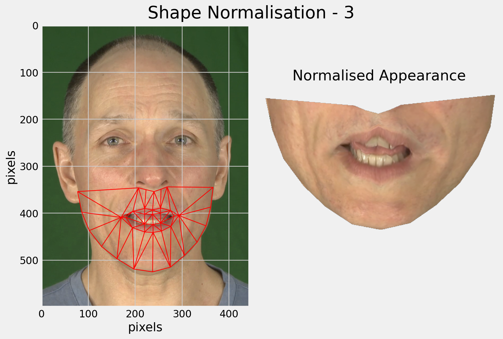{width=90%}

## Appearance Models {data-auto-animate="true"}

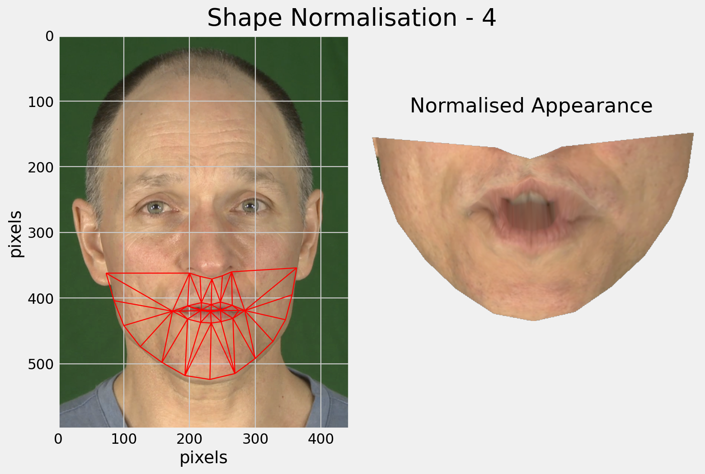{width=90%}

## Appearance Models {data-auto-animate="true"}

::: columns

::::: {.column width=30%}
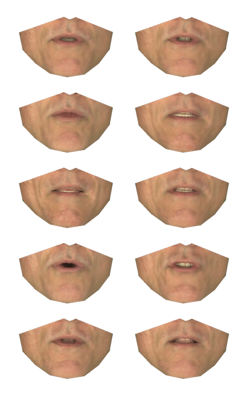
:::::

::::: column

Images are shape-normalised.

- They all have the same number of pixels.
- Each pixel represents the same feature.

:::::

:::

## Appearance Models {data-auto-animate="true"}

::: columns

::::: {.column width=30%}

:::::

::::: column

Applying PCA to the shape-normalised images gives a better model of appearance.

- The shape model and the appearance model can be combined or concatenated.
- The appearance can provide a photo-metric loss for model fitting.

:::::

:::

# Effectiveness of Visual Features

## Effectiveness {data-auto-animate="true"}

Potamianos et al. (1998) compared visual features for automatic lip-reading.

- They trained models for a single talker reciting connected digits and measured accuracy as % correct.

## Effectiveness {data-auto-animate="true"}

::: {style="display:block; font-size:0.75em"}

| Feature Class       | Feature              | Accuracy |
| ------------------- | -------------------- | -------- |
| Articulatory        | Height and Width     | 55.8%    |
|                     | and Area             | 61.9%    |
|                     | and Perimeter        | 64.7%    |
| Fourier Descriptors | Outer Lip Contour    | 73.4%    |
|                     | Inner Lip Contour    | 64.0%    |
|                     | Both Contours        | 83.9%    |
| Appearance          | LDA - based features | 97.0%    |

:::

::: notes
LDA Linear Discriminant Analysis is a statistical method for dimensionality reduction.
:::

## Effectiveness {data-auto-animate="true"}

::: columns

::::: {.column width=65%}
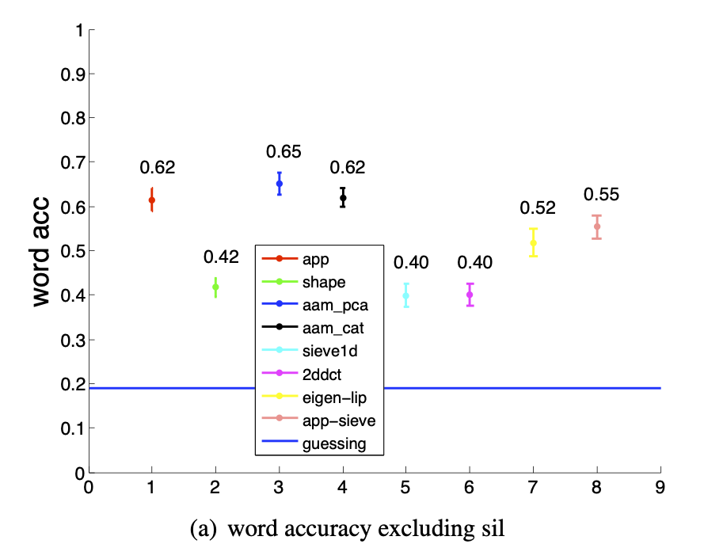
:::::

::::: column

Lan et al. (2010) compared visual features for automatic lip-reading.

::::::: incremental

- Appearance (app)
- PDM (shape)
- DCT (2ddct)
- Eigenface (eigen-lip)
- Shape **and** Appearance (aam-pca)

:::::::
:::::
:::

# Model Fusion

## Audiovisual Fusion {data-auto-animate="true"}

The acoustic and visual information needs to be combined - how and where this happens is important.

- We require that the performance after fusion is not worse than best performing individual modality.

## Audiovisual Fusion {data-auto-animate="true"}

Two strategies:

::: incremental

- Early integration: fusion is prior to recognition, e.g. at the feature level.
- Late integration: fusion is after recognition, e.g. sentence-level.

:::

## Audiovisual Fusion {data-auto-animate="true"}

Usually an estimation of the respective confidence is required.

::: incremental

- Could be fixed, where it is learned during training based on accuracy.
- Could be adaptive, where it reflects the noise in the respective channels.

:::

## Early Integration {data-auto-animate="true"}

Advantage of early integration:

- We can simply concatenate the features.
- The structure of the recogniser does not need to change.

## Early Integration {data-auto-animate="true"}

Disadvantages of early integration:

- Size of the feature vector increases making training more difficult.
- Need to normalise the features from different modalities, or weight them appropriately
- Acoustic noise affects all of the input feature vectors.
- Need to worry about the data rate, which might be different for both modalities.

## Late Integration {data-auto-animate="true"}

Advantages of late integration:

- Acoustic noise will not affect the visual recogniser.
- Easier to adapt the recogniser to different conditions.
- Notionally less training data are required to train the respective models.
- Extends the structure of existing recognisers.
- Either fuse the outputs or use a _multi-stream HMM_.

## Late Integration {data-auto-animate="true"}

Disadvantages of late integration:

- May need to worry about the data rate, which is different for both modalities
- Introduces extra parameters to optimise during training.

# Summary

Integrating visual information can improve the robustness of speech recognisers to acoustic noise.

Face encoding using:

- DCT Features
- Eigenfaces
- Appearance Models
