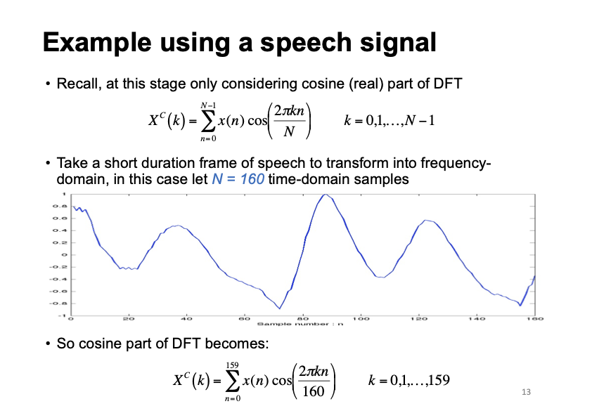
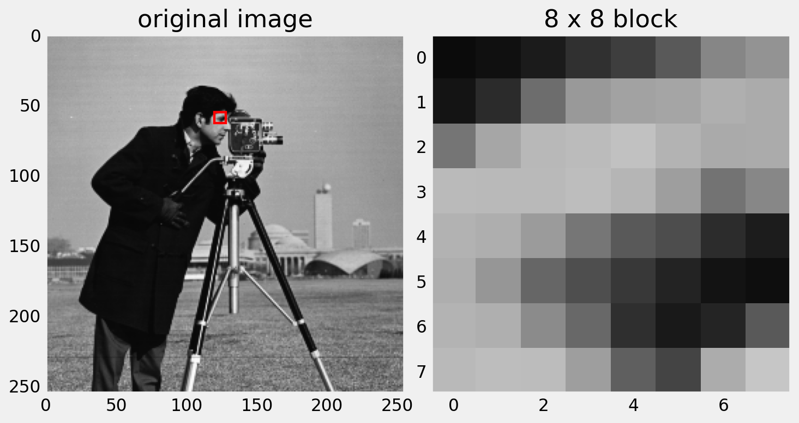
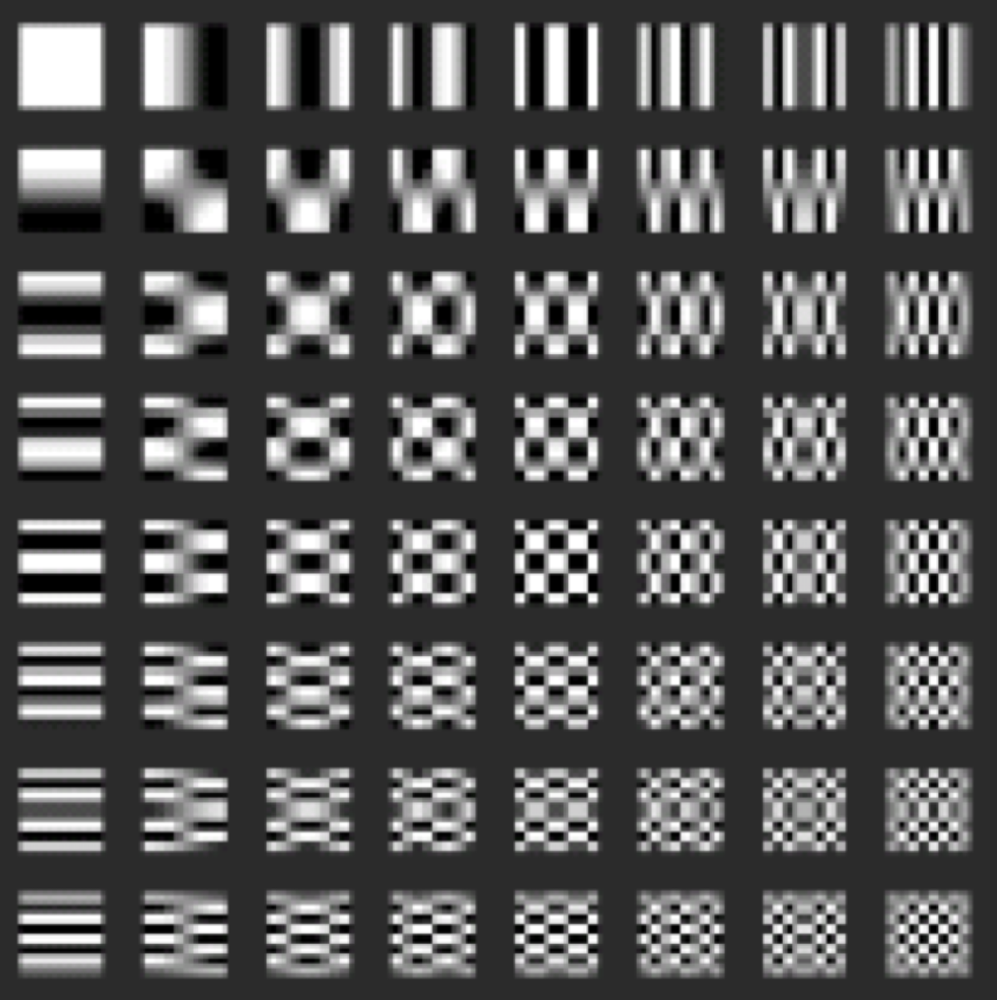
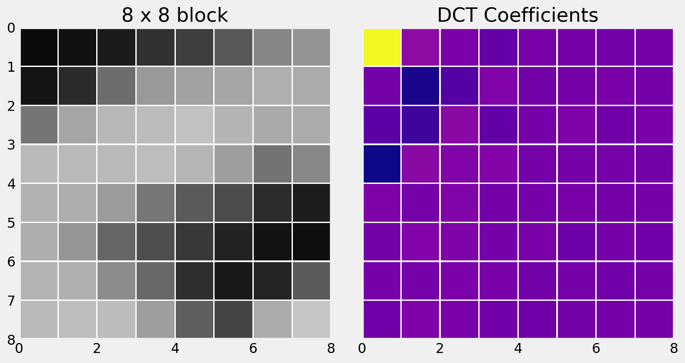
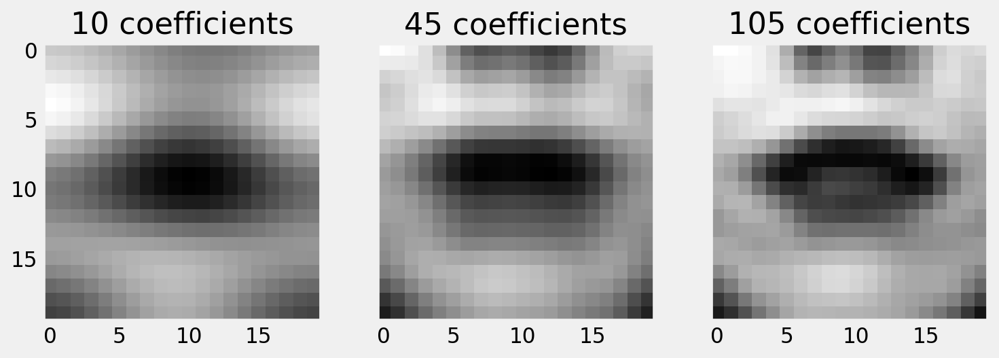
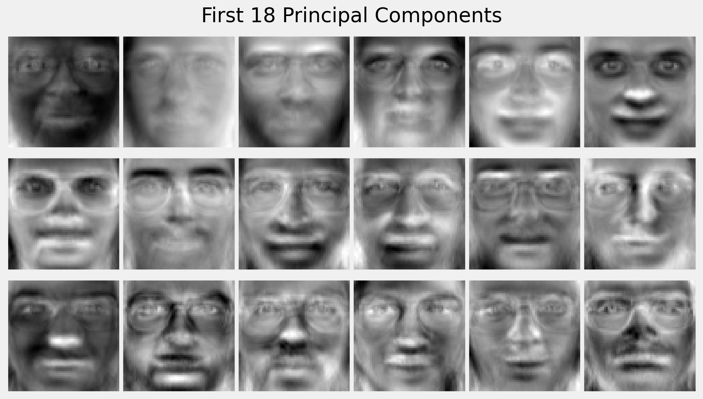

# Content

- DCT Features
- Eigenfaces
- Appearance Models
- Visual Feature Efficacy

## Image-based Features

The main limitation of shape-only features is there is a lot of information missing.

::: incremental

- Modelling only lip-shape discards information about the teeth and tongue for example.
- Why not use the full _appearance_ of the face?

:::

# DCT Features

## Discrete Cosine Transform (DCT)

Performs a similar function to DFT in that it transforms a signal (or image) from the spatial domain to the frequency domain.

- The difference is that it only considers the real-valued cosine components of the DFT.
- We can compact the energy of the signal into the low frequency bins.
- Used in JPEG compression.
- First proposed by Nasir Ahmed in 1972.

## Review: DFT

{width=80%}

## DCT 1D

$$
X_k = s(k) ~ \sum_{n=0}^{N-1} x_n
cos \left[ \frac{\pi k (2n + 1)}{2N} \right]
$$

Where:

- $X$ is the DCT output
- $x$ is the input signal
- $N$ is the number of samples
- $k = 0, 1, 2, \dots, N-1$
- $s(0) = \sqrt{1/N}, ~ s(k \neq 0) = \sqrt{2/N}$

::: notes
MATLAB has the dct function
:::

---

### 8-Point 1-D DCT Basis

::: columns
::::: column

:::::
::::: column

$$Y_k = cos \left[ \frac{\pi k (2n + 1)}{2N} \right]$$

$$n = 0, 1, 2, \dots, N-1$$

:::::
:::

## DCT for 1D Signals

Let's look at one 8 x 8 block in an image.

---

## DCT for 1D Signals

::: {.incremental}

- Most of the energy is concentrated in the low frequency coefficients.
- Images have less high frequency information.

:::

## DCT for 2D Signals

We have only considered vectors so far.

- Images are 2-dimensional (two spatial co-ordinates).
- Apply DCT to both rows and columns of the image.

$$
X_{u, v} = s_u s_v ~ \sum_{x=0}^{N-1} \sum_{y=0}^{N-1} I(x, y) ~
    cos \left[ \frac{\pi u (2x + 1)}{2N} \right]
    cos \left[ \frac{\pi v (2y + 1)}{2N} \right]
$$

## DCT for 2D Signals

::: columns
::::: column

:::::
::::: column

Rather than basis vectors, we have basis images.

:::::
:::

## DCT for 2D Signals

Let's look again at the same 8 x 8 block in an image.

## DCT for 2D Signals

Here is the 2D DCT of the block.

## DCT for 2D Signals

::: columns
::::: column

:::::
::::: column

Let's examine the actual values of the coefficients.

:::::
:::

## DCT for 2D Signals

::: columns
::::: column

:::::
::::: column

Notice that the most significant values congregate at the top left.

:::::
:::

## DCT for 2D Signals

::: columns
::::: column

:::::
::::: column

We can stack the top left values to make a feature vector.

$f = (972, 85, 19, -59, \dots)$

:::::
:::

## DCT for 2D Signals

::: columns
::::: column

:::::
::::: column

If we want to reconstruct the image using the inverse DCT, we can set the low values to zero to view the reconstruction loss.

:::::
:::

## DCT for 2D Signals

::: columns
::::: column

:::::
::::: column

Here you can see we have zeroed the lower right triangle.

You should decide empirically how many coefficients to retain.
Often, many fewer than half produce good results.

:::::
:::

## DCT Features {data-auto-animate="true"}

One approach for modelling the appearance of the face:

::: incremental

- Convert the image to greyscale.
- Crop the image to contain only the region of interest (the mouth).
- Normalise the size of the image to some default size (the images need the same number of pixels in each frame).
- Either resize the cropped regions, or better, use a constant clipping box.

:::

## DCT Features {data-auto-animate="true"}

One approach for modelling the appearance of the face:

::: incremental

- Segment the region into n x n pixel blocks.
- Experiment with $1 \leq n \leq 8$.
- Apply a 2D Discrete Cosine Transform (DCT) to each block.
- Extract coefficients that encode low frequency information.

:::

## 2D DCT case study

A region of interest is cropped, resized and converted to greyscale.

## 2D DCT case study

From the greyscale image, we can extract the DCT coefficients.
We retain only the low frequency coefficients, and show a reconstruction of the image.

## 2D DCT case study

Perceptual evaluations of the reconstruction are informative, but your experiments should determine how useful the features are for recognising speech.

# Eigenfaces

## Eigenfaces {data-auto-animate="true"}

::: incremental

- Crop the images to contain only the region of interest.
- Normalise the size of the image.
- Images need the **same number** of pixels in each frame.
- Resize the images, or better, use a constant clipping box.

:::

## Eigenfaces {data-auto-animate="true"}

::: incremental

- Apply **PCA** to the size-normalised images.
- When applied to face images, referred to as **Eigenfaces**.
- This was the basis of an early face recognition system. (Turk and Pentland, 1990).

:::

## Eigenfaces {data-auto-animate="true"}

## Eigenfaces {data-auto-animate="true"}

Recall, to reconstruct using PCA:

$$\mathbf{x} \approx \mathbf{\overline x} + \mathbf{P} \mathbf{b}$$

## Eigenfaces {data-auto-animate="true"}

A human face can be approximated
from the mean shape plus a linear combination
of the eigenfaces.

## Eigenfaces {data-auto-animate="true"}

{width=50%}

## Eigenfaces {data-auto-animate="true"}

## Eigenfaces {data-auto-animate="true"}

