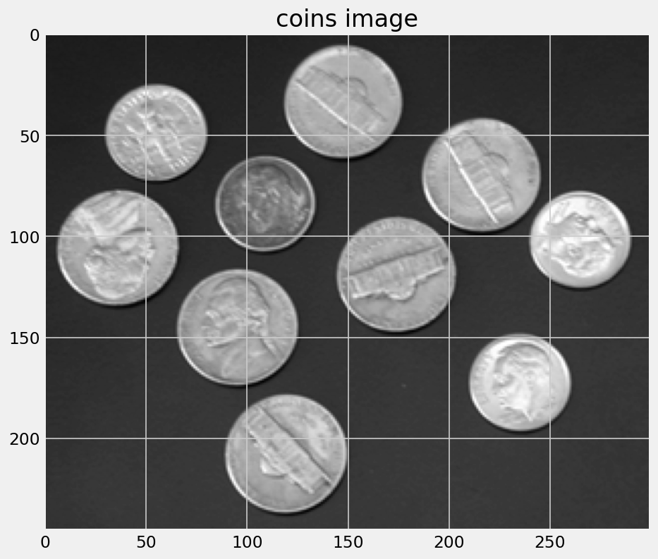

# Content

- Edges from image derivatives
- Laplacian matrices
- Line detection operators
- Canny edge detector

# Edges

An edge in an image is a significant local change or discontinuity in the image intensity.

## Edges {data-auto-animate="true"}

::: columns
::::: column

:::::
::::: column

An image is a 2D matrix of intensities.

:::::
:::

## Edges {data-auto-animate="true"}

::: columns
::::: column

:::::
::::: column

We can look at those intensities in a single row.

:::::
:::

## Edges {data-auto-animate="true"}

::: columns
::::: column

:::::

::::: column

An edge in an image is a significant local change or discontinuity in the image intensity.

:::::
:::

## Image Derivatives {data-auto-animate="true"}

The derivative is the rate of change of a function.

- 1D first order derivative: **difference** in consecutive pixels:
  $$\frac{df}{dx} \approx f(x + 1) - f(x)$$

- 1D second order derivative: **acceleration** of pixel intensity change:
  $$\frac{d^2f}{dx^2} \approx f(x + 1) + f(x - 1) - 2f(x)$$

::: notes
the x is the location along the line of the pixel
:::

# Canny Edge Detector

::: notes

Smooth the image using a Gaussian with sigma width.

Apply the horizontal and vertical Sobel operators to get the gradients within the image. The edge strength is the norm of the gradient.

Thin potential edges to 1-pixel wide curves. First, find the normal to the edge at each point. This is done by looking at the signs and the relative magnitude of the X-Sobel and Y-Sobel to sort the points into 4 categories: horizontal, vertical, diagonal and antidiagonal. Then look in the normal and reverse directions to see if the values in either of those directions are greater than the point in question. Use interpolation to get a mix of points instead of picking the one that’s the closest to the normal.

Perform a hysteresis thresholding: first label all points above the high threshold as edges. Then recursively label any point above the low threshold that is 8-connected to a labeled point as an edge.

:::
