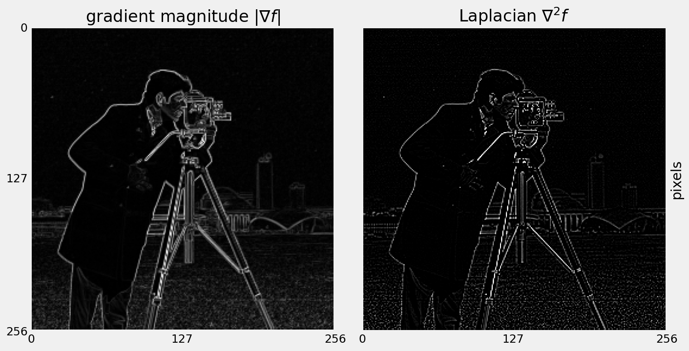

# Content

- Edges from image derivatives
- Laplacian matrices
- Line detection operators
- Canny edge detector

# Edges

An edge in an image is a significant local change or discontinuity in the image intensity.

## Edges {data-auto-animate="true"}

::: columns
::::: column

:::::
::::: column

An image is a 2D matrix of intensities.

:::::
:::

## Edges {data-auto-animate="true"}

::: columns
::::: column

:::::
::::: column

We can look at those intensities in a single row.

:::::
:::

## Edges {data-auto-animate="true"}

::: columns
::::: column

:::::

::::: column

An edge in an image is a significant local change or discontinuity in the image intensity.

:::::
:::

## Image Derivatives {data-auto-animate="true"}

The derivative is the rate of change of a function.

- 1D first order derivative: **difference** in consecutive pixels:
  $$\frac{\delta f}{\delta x} \approx f(x + 1) - f(x)$$

- 1D second order derivative: **acceleration** of pixel intensity change:
  $$\frac{\delta^{2}f}{\delta {x}^2} \approx f(x + 1) + f(x - 1) - 2f(x)$$

::: notes
the x is the location along the line of the pixel -
The first derivative, in 1D, can be thought of as a tangent - wth a slope - or gradient.
We used a partial derivative here in order to keep the notation consistent when we consider an image function of two variables.
:::

---

## Image Derivatives {data-auto-animate="true"}

For images, we must consider the derivative in both directions:

$$\frac{\delta f}{\delta x} \approx f(x + 1, y) - f(x, y)$$

$$\frac{\delta f}{\delta y} \approx f(x, y + 1) - f(x, y)$$

::: notes
We used a partial derivative here in order to keep the notation consistent when we consider an image function of two variables.
:::

## Image Derivatives {data-auto-animate="true"}

An image _gradient_ is formed of two components:

$$\nabla f = \left[ \frac{\delta f}{\delta x}, \frac{\delta f}{\delta y} \right]$$

::: notes
The first derivative, in 1D, can be thought of as a tangent - wth a slope - or gradient.
:::

## Image Derivatives {data-auto-animate="true"}

## Image Derivatives {data-auto-animate="true"}

Required properties of first derivatives:

::: incremental

- Zero in regions of constant intensity
- Non-zero at onset of a ramp or step
- Non-zero along intensity ramps

:::

::: notes
Derivatives of a digital function are defined in terms of differences. There are various ways to define these differences. However, we require that any definition we use for a derivative has these properties.
:::

## Image Derivatives {data-auto-animate="true"}

Required properties of second derivatives:

::: incremental

- Zero in regions of constant intensity
- Non-zero at the onset **and** end of an intensity step or ramp.
- _Zero_ along intensity ramps.

:::

## Image Derivatives {data-auto-animate="true"}

Image gradient is a vector:

$$\nabla f = \left[ \frac{\delta f}{\delta x}, \frac{\delta f}{\delta y} \right]$$

## Image Derivatives {data-auto-animate="true"}

A vector has magnitude...

$$|\nabla f| = \sqrt{\left( \frac{\delta f}{\delta x} \right)^{2} + \left( \frac{\delta f}{\delta y} \right)^{2}}$$

Magnitude is the _strength_ of the edge.

## Image Derivatives {data-auto-animate="true"}

A vector has direction...

$$ \theta = \tan^{-1} \left( \frac{\delta f}{\delta x} / \frac{\delta f}{\delta y} \right) $$

Direction of an edge is **perpendicular** to the gradient direction.

## Image Derivatives {data-auto-animate="true"}

::: columns
::::: column

:::::
::::: column

::: incremental

- The gradient points in the direction of most rapid change in intensity.
- **Perpendicular** to the edge direction.

:::

:::::
:::

## Image Derivatives {data-auto-animate="true"}

{width=50%}

## Image Derivatives {data-auto-animate="true"}

First order derivatives:

::: incremental

- produce thicker edges in images
- have a stronger response to stepped intensity changes

:::

## Second Order Derivatives {data-auto-animate="true"}

Second order derivatives:

::: incremental

- have a stronger response to fine detail
- are more aggressive at enhancing detail
- Generally, second-order derivatives are _preferred._

:::

## Second Order Derivatives {data-auto-animate="true"}

$$\nabla^{2} f = \frac{\delta^{2} f}{\delta x^{2}} + \frac{\delta^{2} f}{\delta y^{2}}$$

Derivative in this form is known as the **Laplacian**.

::: notes
Derived by computing 2nd order derivatives in each direction and then summing.
:::

# Laplacian {data-auto-animate="true"}

We know:

$$\frac{\delta^{2}f}{\delta {x}^2} \approx f(x + 1) + f(x - 1) - 2f(x)$$

$$\frac{\delta^{2}f}{\delta {y}^2} \approx f(y + 1) + f(y - 1) - 2f(y)$$

## Laplacian {data-auto-animate="true"}

So, the Laplacian is calculated as:

$$\nabla^{2} f = f(x + 1) + f(x - 1) + f(y + 1) + f(y - 1) - 4f(x, y)$$

## Laplacian {data-auto-animate="true"}

$$
\begin{bmatrix}
  0 & 1 & 0 \\
  1 & -4 & 1 \\
  0 & 1 & 0
\end{bmatrix}
$$

The Laplacian can also be calculated by **convolving** the image with this filter.

## Laplacian {data-auto-animate="true"}

## Laplacian {data-auto-animate="true"}

# Canny Edge Detector

::: notes

Smooth the image using a Gaussian with sigma width.

Apply the horizontal and vertical Sobel operators to get the gradients within the image. The edge strength is the norm of the gradient.

Thin potential edges to 1-pixel wide curves. First, find the normal to the edge at each point. This is done by looking at the signs and the relative magnitude of the X-Sobel and Y-Sobel to sort the points into 4 categories: horizontal, vertical, diagonal and antidiagonal. Then look in the normal and reverse directions to see if the values in either of those directions are greater than the point in question. Use interpolation to get a mix of points instead of picking the one that’s the closest to the normal.

Perform a hysteresis thresholding: first label all points above the high threshold as edges. Then recursively label any point above the low threshold that is 8-connected to a labeled point as an edge.

:::
