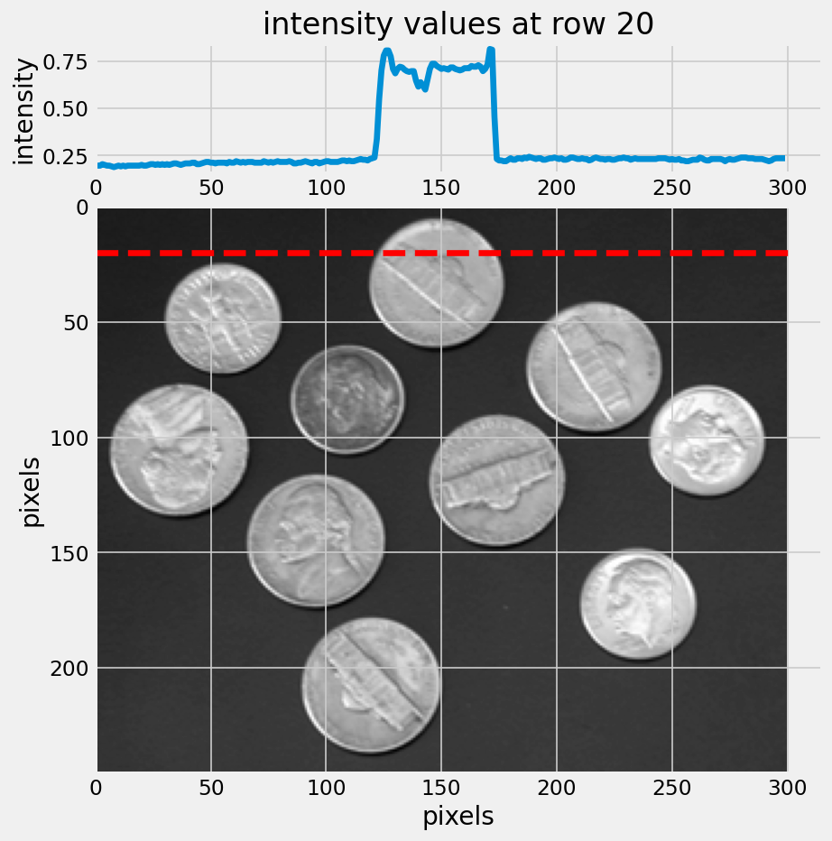
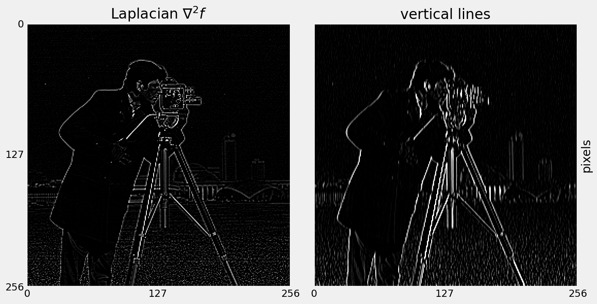
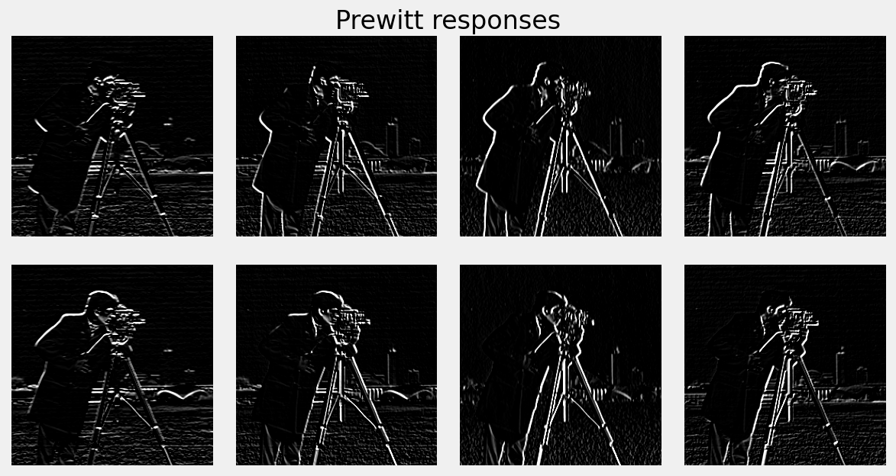

# Content

- Edges from image derivatives
- Laplacian matrices
- Line detection operators
- Canny edge detector

# Edge Detection

Convert an image into a set of **curves**.

::: incremental

- Extracts salient _features_ of the image.
- Far more _compact_ than pixels.

:::

## Edges

An _edge_ in an image is a significant local change or discontinuity in the image intensity.

## Edges

Edges come from discontinuity in:

::: incremental

- surface normal
- depth
- surface color
- illumination

:::

::: notes
the shape or form of an object
one object in front of another
colour
lighting
:::

## Edges {data-auto-animate="true"}

::: columns
::::: column

:::::
::::: column

An image is a 2D matrix of intensities.

:::::
:::

## Edges {data-auto-animate="true"}

::: columns
::::: column

:::::
::::: column

We can look at those intensities in a single row.

:::::
:::

## Edges {data-auto-animate="true"}

::: columns
::::: column

:::::

::::: column

We can see how edges are defined by these changes in intensity.

:::::
:::

## Derivatives {data-auto-animate="true"}

The derivative is the rate of change of a function.

- 1D _first_ order derivative: **difference** in consecutive pixels:
  $$\frac{\delta f}{\delta x} \approx f(x + 1) - f(x)$$

::: notes
this is one way of approximating the derivative...we could use the difference to the left or right.
:::

## Derivatives {data-auto-animate="true"}

The derivative is the rate of change of a function.

- 1D _second_ order derivative: **acceleration** of pixel intensity change:
  $$\frac{\delta^{2}f}{\delta {x}^2} \approx f(x + 1) + f(x - 1) - 2f(x)$$

::: notes
the x is the location along the line of the pixel -
The first derivative, in 1D, can be thought of as a tangent - wth a slope - or gradient.
We used a partial derivative here in order to keep the notation consistent when we consider an image function of two variables.
:::

## Derivatives {data-auto-animate="true"}

Required properties of first derivatives:

::: incremental

- Zero in regions of constant intensity
- Non-zero at onset of a ramp or step
- Non-zero along intensity ramps

:::

::: notes
Derivatives of a digital function are defined in terms of differences.
There are various ways to define these differences.
However, we require that any definition we use for a derivative has these properties.
:::

## Derivatives {data-auto-animate="true"}

Required properties of second derivatives:

::: incremental

- Zero in regions of constant intensity
- Non-zero at the onset **and** end of an intensity step or ramp.
- _Zero_ along intensity ramps.

:::

## Derivatives {data-auto-animate="true"}

{width=80%}

::: notes
It might be helpful to look at some specific values as a concrete example.
notice we lose some dimension by taking differences.
:::

## Derivatives {data-auto-animate="true"}

::: notes
Going back to our row of pixels, we can see how some real data looks.
:::

## Image Derivatives {data-auto-animate="true"}

For images, we must consider the derivative in both directions:

$$\frac{\delta f}{\delta x} \approx f(x + 1, y) - f(x, y)$$

$$\frac{\delta f}{\delta y} \approx f(x, y + 1) - f(x, y)$$

::: notes
We used a partial derivative here in order to keep the notation consistent when we consider an image function of two variables.
:::

## Image Derivatives {data-auto-animate="true"}

## Image Derivatives {data-auto-animate="true"}

An image _gradient_ is formed of two components:

$$\nabla f = \left[ \frac{\delta f}{\delta x}, \frac{\delta f}{\delta y} \right]$$

::: notes
The first derivative, in 1D, can be thought of as a tangent - wth a slope - or gradient.
:::

## Image Derivatives {data-auto-animate="true"}

Image gradient is a vector:

$$\nabla f = \left[ \frac{\delta f}{\delta x}, \frac{\delta f}{\delta y} \right]$$

## Image Derivatives {data-auto-animate="true"}

A vector has magnitude...

$$|\nabla f| = \sqrt{\left( \frac{\delta f}{\delta x} \right)^{2} + \left( \frac{\delta f}{\delta y} \right)^{2}}$$

Magnitude is the _strength_ of the edge.

::: notes
The magnitude is always positive.
:::

## Image Derivatives {data-auto-animate="true"}

A vector has direction...

$$ \theta = \tan^{-1} \left( \frac{\delta f}{\delta y} / \frac{\delta f}{\delta x} \right) $$

Direction of an edge is **perpendicular** to the gradient direction.

## Image Derivatives {data-auto-animate="true"}

::: columns
::::: column

:::::
::::: column

::: incremental

- The gradient points in the direction of most rapid change in intensity.
- **Perpendicular** to the edge direction.

:::

:::::
:::

## Image Derivatives {data-auto-animate="true"}

{width=50%}

## Image Derivatives {data-auto-animate="true"}

First order derivatives:

::: incremental

- produce thicker edges in images
- have a stronger response to stepped intensity changes

:::

## Second Order Derivatives {data-auto-animate="true"}

Second order derivatives:

::: incremental

- have a stronger response to fine detail
- are more aggressive at enhancing detail
- Generally, second-order derivatives are _preferred._

:::

## Second Order Derivatives {data-auto-animate="true"}

$$\nabla^{2} f = \frac{\delta^{2} f}{\delta x^{2}} + \frac{\delta^{2} f}{\delta y^{2}}$$

Derivative in this form is known as the **Laplacian**.

::: notes
Derived by computing 2nd order derivatives in each direction and then summing.
:::

# Laplacian {data-auto-animate="true"}

We know:

$$\frac{\delta^{2}f}{\delta {x}^2} \approx f(x + 1) + f(x - 1) - 2f(x)$$

$$\frac{\delta^{2}f}{\delta {y}^2} \approx f(y + 1) + f(y - 1) - 2f(y)$$

## Laplacian {data-auto-animate="true"}

So, the Laplacian is calculated as:

$$\nabla^{2} f = f(x + 1) + f(x - 1) + f(y + 1) + f(y - 1) - 4f(x, y)$$

::: notes
summing the two second order derivatives in each direction.
:::

## Laplacian {data-auto-animate="true"}

$$
\begin{bmatrix}
  0 & 1 & 0 \\
  1 & -4 & 1 \\
  0 & 1 & 0
\end{bmatrix}
$$

The Laplacian can also be calculated by **convolving** the image with this filter.

## Laplacian {data-auto-animate="true"}

## Laplacian {data-auto-animate="true"}

::: notes
I hope you will agree that the first order derivatives produce thicker edges.
:::

# Line Detection {data-auto-animate="true"}

The Laplacian responds strongly to _any_ detail in the image.

## Line Detection {data-auto-animate="true"}

What if we only wanted to detect lines that point in a certain direction?

$$
\begin{bmatrix}
  -1 & 2 & -1 \\
  -1 & 2 & -1 \\
  -1 & 2 & -1
\end{bmatrix}
$$

## Line Detection {data-auto-animate="true"}

## Line Detection {data-auto-animate="true"}

What about detecting edges in other directions?

## Line Detection {data-auto-animate="true"}

What about detecting edges in other directions?

## Line Detection {data-auto-animate="true"}

Previous filter gives strong response along a line.

::: incremental

- **But...** also responds at isolated pixels.
- Edge detector should respond _only_ to edges

:::

## Line Detection {data-auto-animate="true"}

Look either side of candidate pixel...

::: incremental

- but ignore the pixel itself.

:::

## Line Detection {data-auto-animate="true"}

Two popular _first-order_ operators are **Prewitt** and **Sobel**.

Both provide approximations of derivatives.

## Line Detection {data-auto-animate="true"}

## Line Detection {data-auto-animate="true"}

## Line Detection {data-auto-animate="true"}

::: notes
Described in a talk, at the Stanford Artificial Intelligence Project, published rather later.
:::

## Line Detection {data-auto-animate="true"}

::: notes
Described in a talk, at the Stanford Artificial Intelligence Project, published rather later.
:::

---

For each pixel, find the maximum value from all of the filter responses, and then threshold.

::: notes
So, to turn back to detection of edges, we take the max of each directional response, and threshold, maybe 200 for 8 bit images.
:::

---

::: columns
::::: {.column width=45%}

:::::
::::: column

We rarely observe _ideal_ edges in real images.

- Lens imperfections
- sensor noise, etc.
- Edges appear more like noisy ramps.

:::::
:::

::: notes
These issues present problems for gradient-based edge detection.
:::

## Edge Detection {data-auto-animate="true"}

Four limitations with basic gradient-based edge detection:

::: incremental

- Hard to set the optimal value for the threshold.
- Edges are broken (known as streaking)
- Edges can be poorly localised
- An edge might produce more than one response

:::

# Canny Edge Detector{data-auto-animate="true"}

The **Canny Edge Detector** is _optimal_ with respect to gradient-based limitations.

::: notes
Canny, J. (1986) A computational approach to edge detection. >35k citations.
:::

## Canny Edge Detector

Requirements for a _good_ edge detector:

::: incremental

- Good detection - respond to edges, not noise.
- Good localisation - detected edge near real edge.
- Single response - only one response per edge.

:::

## Canny Edge Detector

Canny provides an elegant solution to edge detection.

::: incremental

- Canny provides a _hacky_ solution to edge detection!

:::

## Canny Edge Detector

Canny Edge Detection is a four step process:

::: incremental

1. Convolve image with Gaussians of particular scales.
2. Compute gradient magnitude and direction.
3. Perform **non-maximal** suppression to thin the edges.
4. Threshold edges with **hysteresis**.

:::

## Canny Edge Detector

Step 1: Convolve image with Gaussians of particular scales.

- Smoothing helps ensure robustness to noise.
- The size of the Gaussian kernel affects the performance of the detector.

## Canny Edge Detector

Step 2: Compute gradient _magnitude_ and _direction_:

- Using Sobel operators.

**Quantise** the angle of the gradient:

- Discrete nature of image limits the possible angle.
- Angle can only be {0, 45, 90, 135} degrees.

::: notes
Gradient direction is always perpendicular to edges.
It is rounded to one of four angles representing vertical, horizontal and two diagonal directions.
:::

## Canny Edge Detector

Step 3: Perform **non-maximal** suppression.

::: columns
::::: {.column width=40%}

:::::
::::: column

::: incremental

- An edge-thinning technique.
- Searches for maximum value along direction of gradient and sets all others to zero.
- Result is a one pixel wide curve.

:::

:::::
:::

::: notes
After getting gradient magnitude and direction, a full scan of image is done to remove any unwanted pixels which may not constitute the edge.

For this, at every pixel, the pixel is checked if it is a local maximum in its neighbourhood in the direction of gradient. (look along direction of gradient)
:::

## Canny Edge Detector {data-auto-animate="true"}

Step 4: Threshold edges with **hysteresis**.

- Hysteresis is the dependence of the state of a system on its history.

::: notes
Finally, hysteresis is used as a means of eliminating streaking. Streaking is the breaking up of an edge contour caused by the operator output fluctuating above and below the threshold.
If a single threshold, T is applied to an image, and an edge has an average strength equal to T, then due to noise, there will be instances where the edge dips below the threshold.
Equally it will also extend above the threshold making an edge look like a dashed line.
:::

## Canny Edge Detector {data-auto-animate="true"}

Step 4: Threshold edges with **hysteresis**.

Use **two** thresholds: $T_{min}$ and $T_{max}$.

$$
\begin{aligned}
E(x, y) = \begin{cases}
1~ & E(x, y) \geq T_{max} \\
0~ & E(x, y) < T_{min}
\end{cases}
\end{aligned}
$$

::: notes
To avoid this, hysteresis uses 2 thresholds, a high and a low.

Any edges with intensity gradient more than Tmax are sure to be edges and those below Tmin are sure to be non-edges, so discarded.

Those who lie between these two thresholds are classified edges or non-edges based on their connectivity.
If they are connected to "sure-edge" pixels, they are considered to be part of edges.
Otherwise, they are also discarded.
:::

## Canny Edge Detector {data-auto-animate="true"}

Step 4: Threshold edges with **hysteresis**.

::: {style="font-size:0.8em"}

$$
\begin{aligned}
E(x, y) = \begin{cases}
1 &T_{min} \leq E(x, y) < T_{max} \iff \text{linked to an edge} \\
0 &T_{min} \leq E(x, y) < T_{max}~ \text{  otherwise}
\end{cases}
\end{aligned}
$$

:::

## Canny Edge Detector {data-auto-animate="true"}

::: notes
MATLAB has an implementation of Canny Edge Detector, with the `edge` function.
:::

## Canny Edge Detector {data-auto-animate="true"}

# Summary

- Image derivatives
- Laplacian operator
- Line detection kernels
- Canny Edge Detector

::: notes
Image derivatives consider derivatives in both x and y directions
First and second order derivatives have different strengths and weaknesses
Laplacian matrices encode the 2D second order derivatives of an image
Images can be convolved with line detection filter kernels to detect edges in different directions.
Canny edge detector is a better approach.
:::
