# Content

Lossy and lossless image compression.

- Changing colour spaces and subsampling
- DCT and quantisation
- Run-length encoding
- Entropy coding

::: notes
JPEG compression
:::

# Image Coding

How can we compress an image without destroying the image?

::: incremental

- Data and information are not the same thing.
- Goal is to identify and remove redundancy.

:::

## Lossy or Lossless {data-auto-animate="true"}

Lossless:

- Image can be reconstructed **exactly**.

## Lossy or Lossless {data-auto-animate="true"}

Lossy:

- Inflated image is an _approximation_ of the original.
- How much loss is _acceptable_?

::: notes
how do we decide on acceptable?
:::

## Image Redundancy {data-auto-animate="true"}

Inter-pixel redundancy:

- Neighbouring pixels are related to one another

## Image Redundancy {data-auto-animate="true"}

Coding redundancy:

- Not all pixel intensities are equally likely

## Image Redundancy {data-auto-animate="true"}

Pycho-visual redundancy:

- We are not visually _sensitive_ to everything in the image

# JPEG Compression {data-auto-animate="true"}

## JPEG Compression {data-auto-animate="true"}

::: incremental

- A framework for compressing images.
- Many algorithms can be used in the framework.
- Developed by [Joint Photographic Expert Group](https://jpeg.org).
- JPEG exploits the three forms of redundancy outlined.

:::

::: notes
JPEG is one of most common compression standards
:::

## JPEG Compression {data-auto-animate="true"}

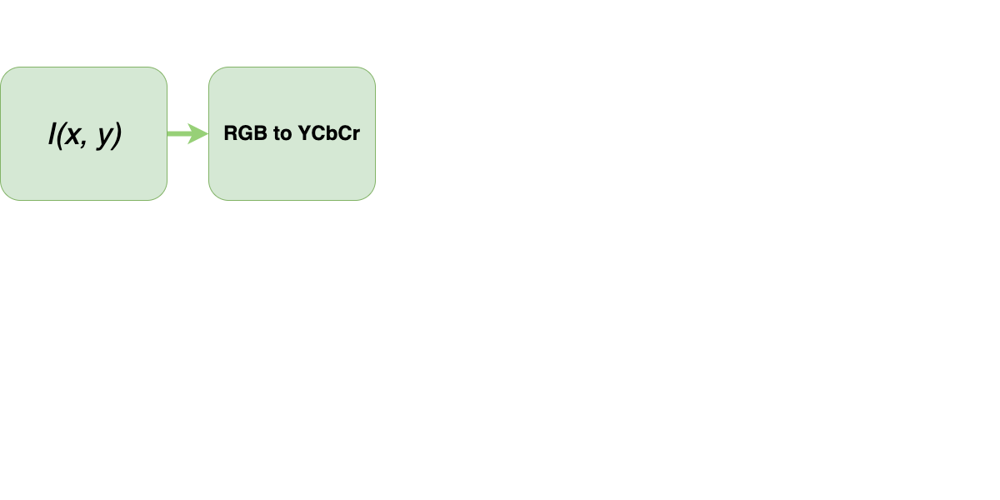

# $Y C_b C_r$

$$
\begin{aligned}
    Y &= 0.299R + 0.587G + 0.114B \\
    C_b &= 128(B-Y) \\
    C_r &= 128(R-Y)
\end{aligned}
$$

## Luminance {data-auto-animate="true"}

$$Y = 0.299R + 0.587G + 0.114B$$

Humans are more sensitive to luminance...

## Chrominance {data-auto-animate="true"}

$$
\begin{aligned}
    C_b &= 128(B-Y) \text{ : red relative to luminance}\\
    C_r &= 128(R-Y) \text{ : blue relative to luminance}
\end{aligned}
$$

Humans are less sensitive to chrominance...

::: notes
100 million rods for luminance
6 million cones for colour
:::

## $Y C_b C_r$ {data-auto-animate="true"}

We can downsample the chrominance channels without affecting the image in a _perceptible_ way.

- Exploits **psycho-visual** redundancy.

## JPEG Compression {data-auto-animate="true"}

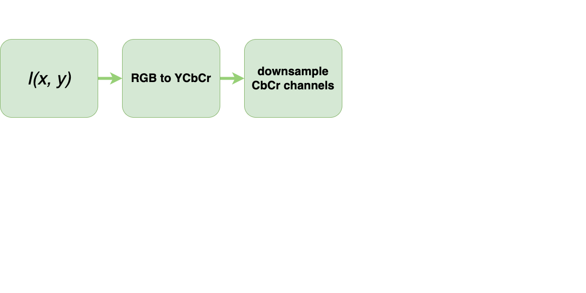

# Chroma Subsampling {data-auto-animate="true"}

Subsampling scheme is expressed as a ratio **J:a:b**

- represents a conceptual window on the _chrominance_ channels.

## Chroma Subsampling {data-auto-animate="true"}

- **J**: horizontal sampling reference. Usually, 4.
- **a**: number of pixels in the top row that will have chroma information.
- **b**: number of _changes_ of samples (Cr, Cb) between first and second row of J pixels.

## Chroma Subsampling {data-auto-animate="true"}

::: image

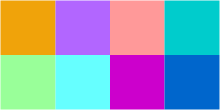{width=80%}

:::

::: notes
Consider a sample window where J=4, and we have two rows a and b.
:::

## Chroma Subsampling {data-auto-animate="true"}

::: image

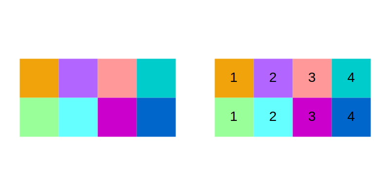{width=100%}

:::

::: notes
Four samples from top row "a", 4 different sample locations from "b", therefore NO compression.
:::

## Chroma Subsampling {data-auto-animate="true"}

::: image

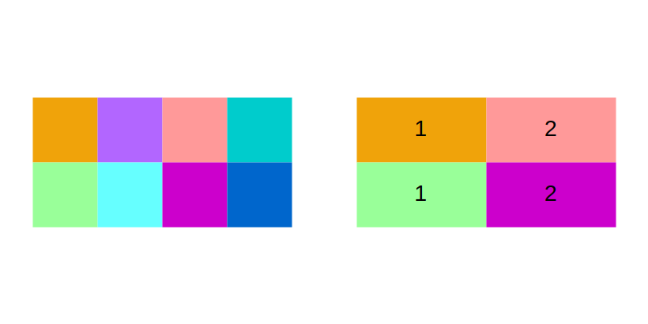{width=100%}

:::

::: notes
Two samples from top row "a", 2 different sample locations from "b"...
:::

## Chroma Subsampling {data-auto-animate="true"}

::: image

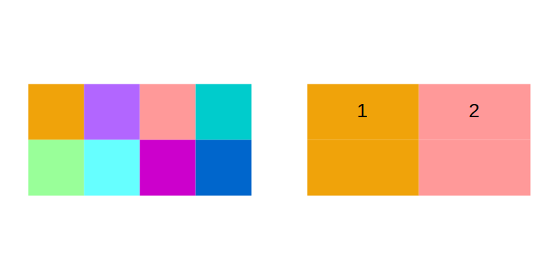{width=100%}

:::

::: notes
Two samples from top row "a", ZERO different sample locations from "b"...
:::

## JPEG Compression {data-auto-animate="true"}

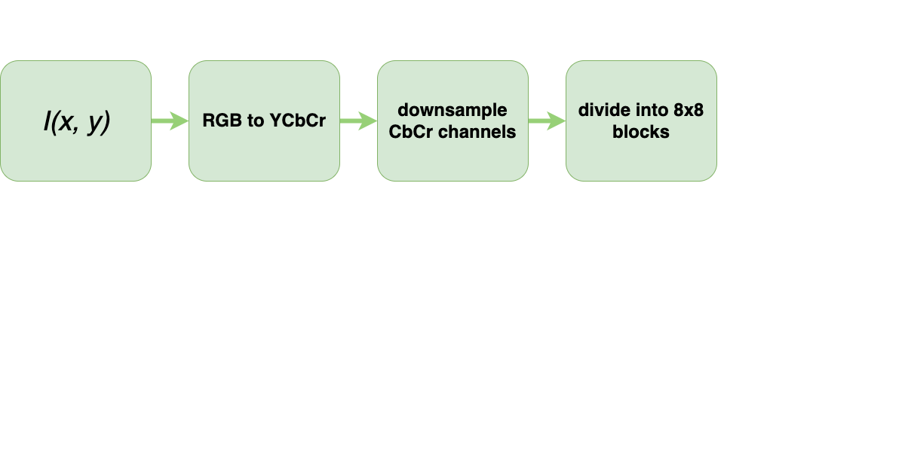

## JPEG Compression {data-auto-animate="true"}

::: columns

::::: column

:::::

::::: column

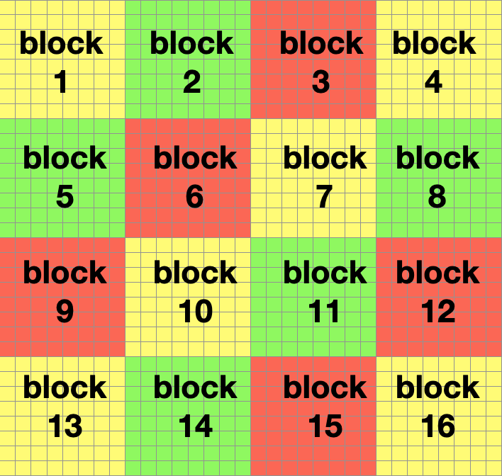

:::::

:::

## JPEG Compression {data-auto-animate="true"}

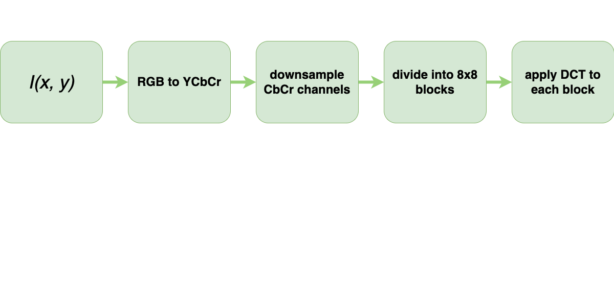

# DCT {data-auto-animate="true"}

Transforms the image into the _frequency domain_.

## DCT {data-auto-animate="true"}

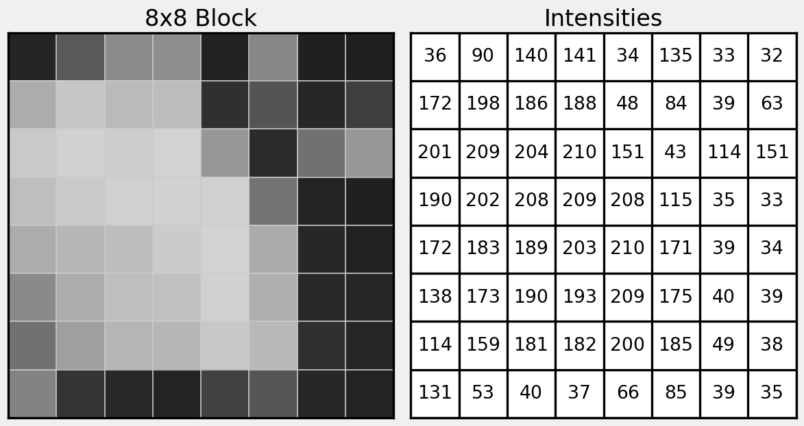

::: notes
lets just follow what happens to some image values in the DCT
:::

## DCT {data-auto-animate="true"}

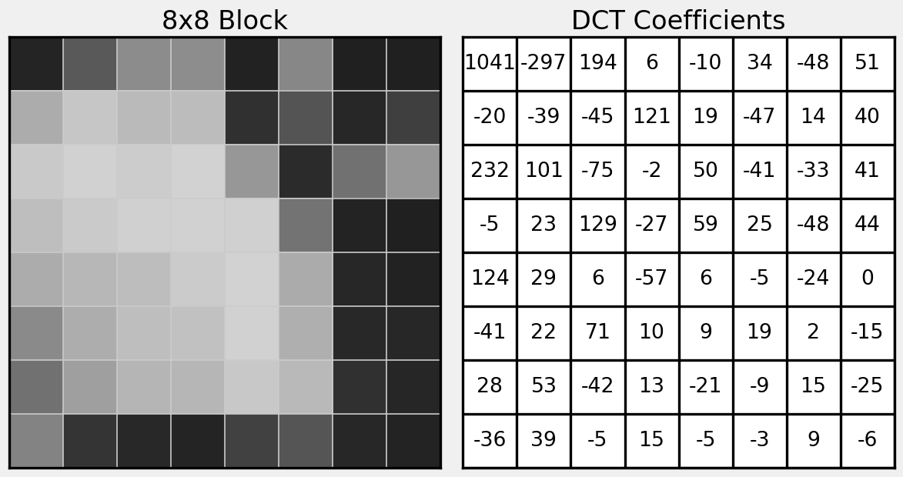

::: notes
2D DCT coefficients - as we have already discussed in lectures and labs.
:::

## JPEG Compression {data-auto-animate="true"}

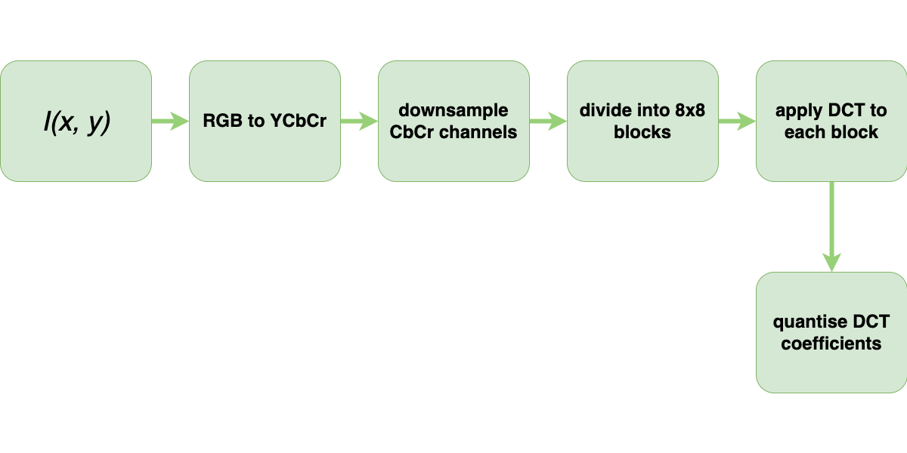

::: notes
This part is new to us. Quantising the coefficients.
:::

# DCT Quantisation {data-auto-animate="true"}

Reduce the number of bits needed to store a value by reducing precision.

- Decrease precision as we move away from the top left corner.
- High frequency details usually contribute less to the image.

## DCT Quantisation {data-auto-animate="true"}

Quantisation is performed as follows:

$$DCT_{q}(i, j) = round \left( \frac{DCT(i, j)}{Q(i, j)} \right)$$

where $Q$ is the quantisation matrix.

## DCT Quantisation {data-auto-animate="true"}

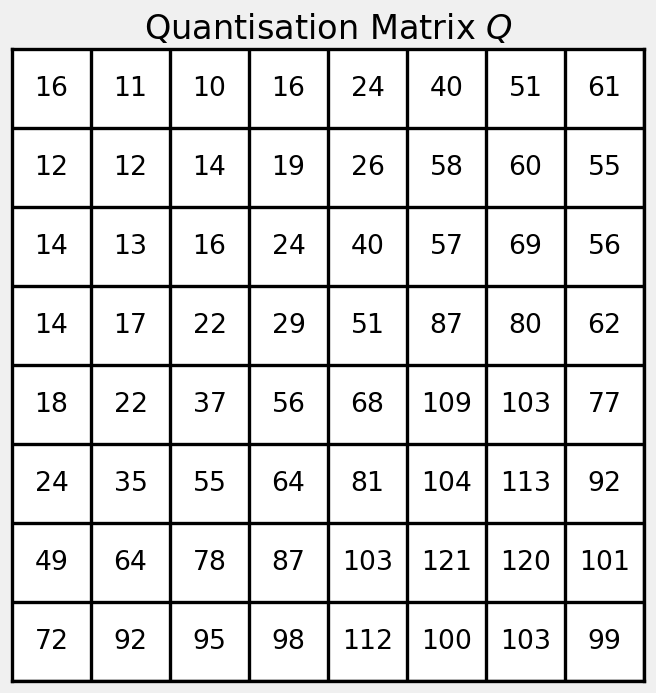{width=50%}

::: notes
Quantisation matrix is a 2D array of values. The values are decided empirically or by subjective judgement, although there are now well defined examples.
:::

## DCT Quantisation {data-auto-animate="true"}

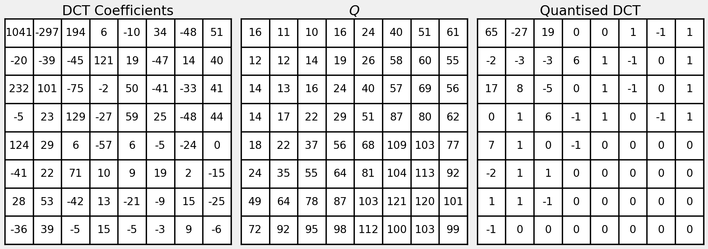

## DCT Quantisation {data-auto-animate="true"}

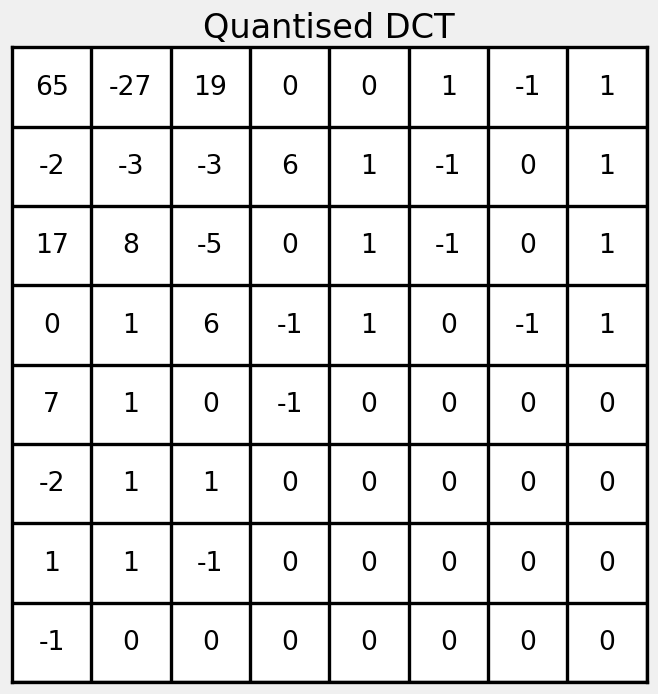{width=50%}

## JPEG Compression {data-auto-animate="true"}

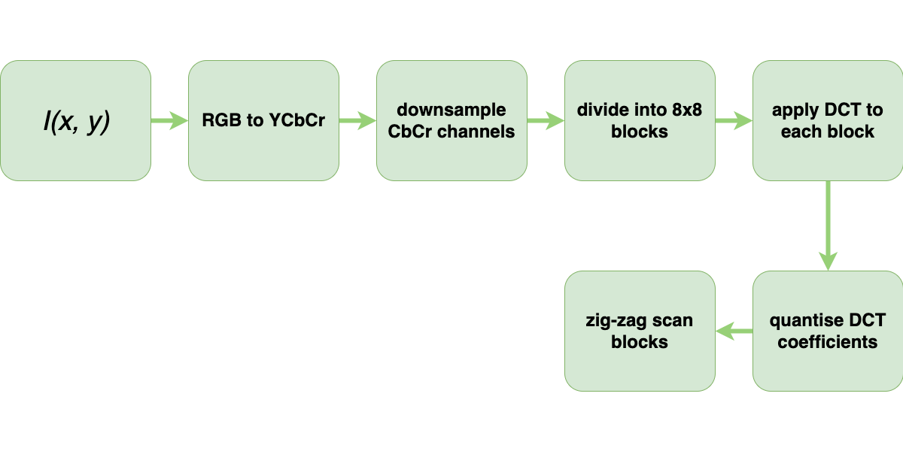

::: notes
zig zag scan - recall the location of the most significant coefficients.
:::

## ZigZag Scan {data-auto-animate="true"}

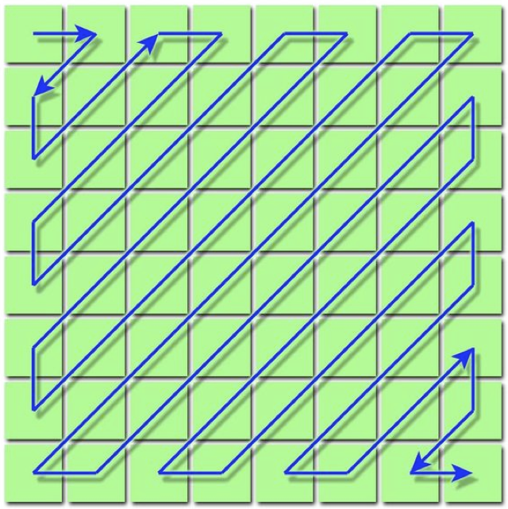{width=50%}

## ZigZag Scan {data-auto-animate="true"}

{width=50%}

## ZigZag Scan {data-auto-animate="true"}

::: columns
::::: column
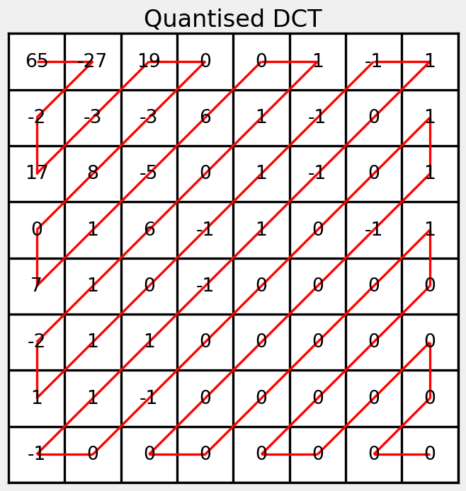
:::::
::::: column

$65, -27, -2, 17, -3,$
$19, 0, -3, 8, 0, ...$

:::::
:::

## ZigZag Scan {data-auto-animate="true"}

::: columns
::::: column

:::::
::::: column

Reads from low frequency coefficients to high frequency coefficients...

:::::
:::

## ZigZag Scan {data-auto-animate="true"}

::: columns
::::: column

:::::
::::: column

More likely to encode all non-zeros and all zeros together...

- beneficial for the next step...

:::::
:::

## JPEG Compression {data-auto-animate="true"}

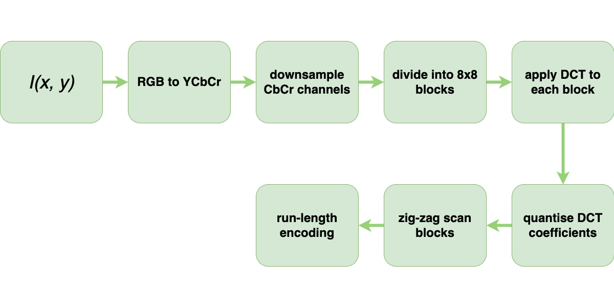

# Run Length Encoding {data-auto-animate="true"}
