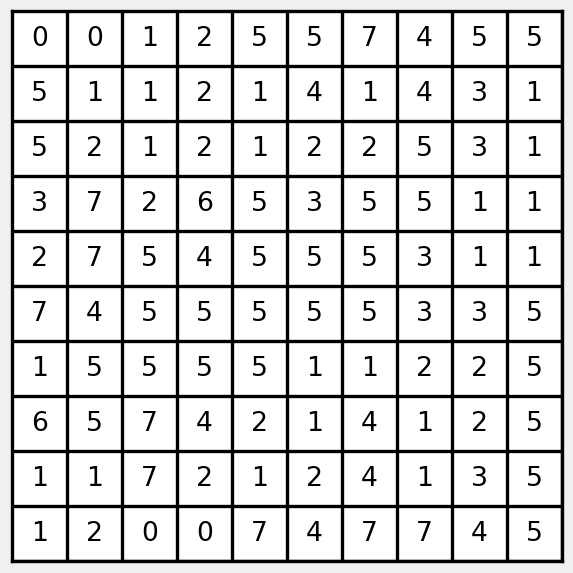
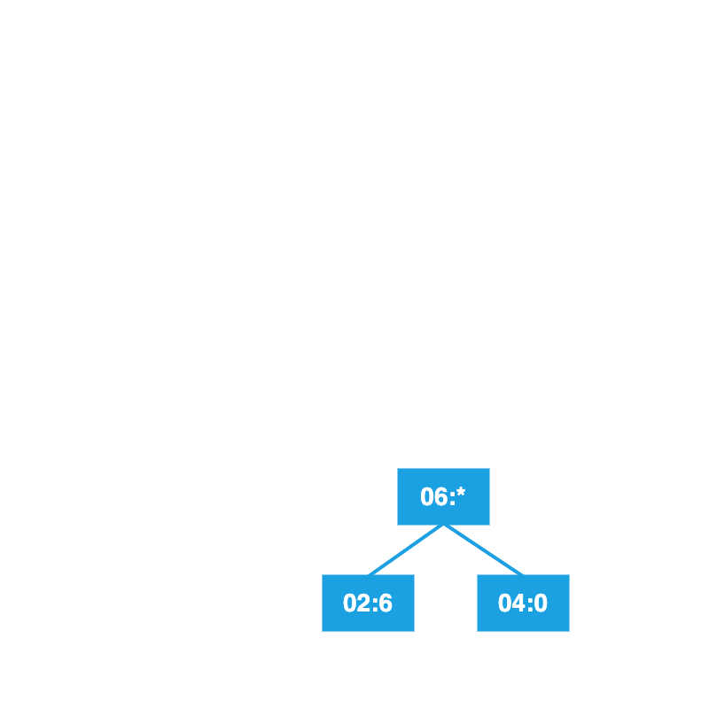
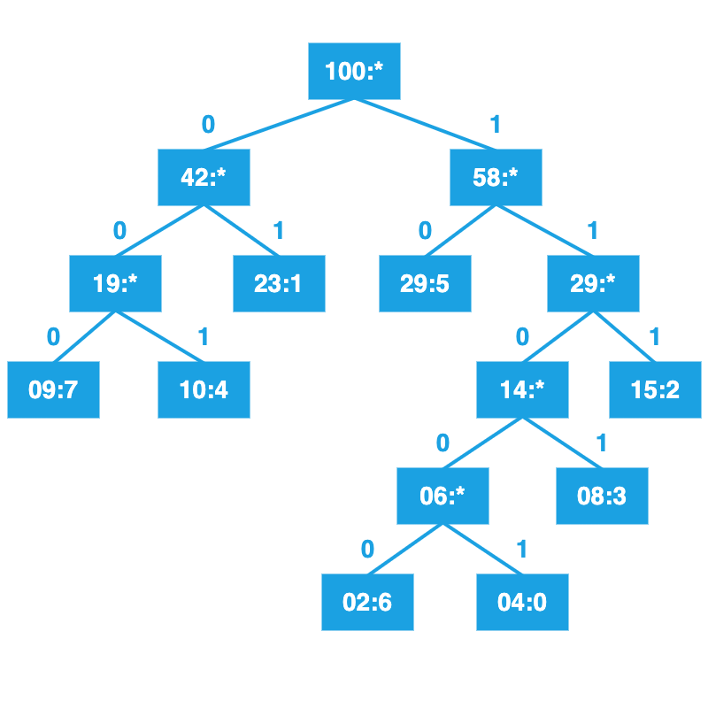
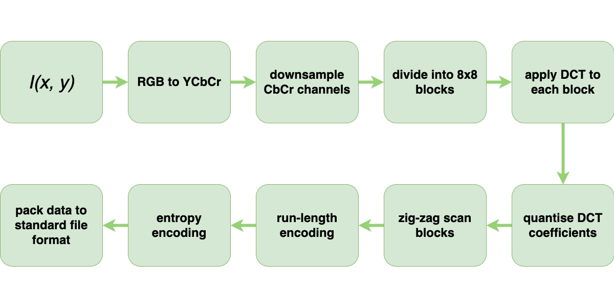
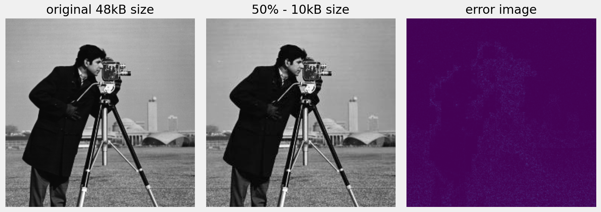
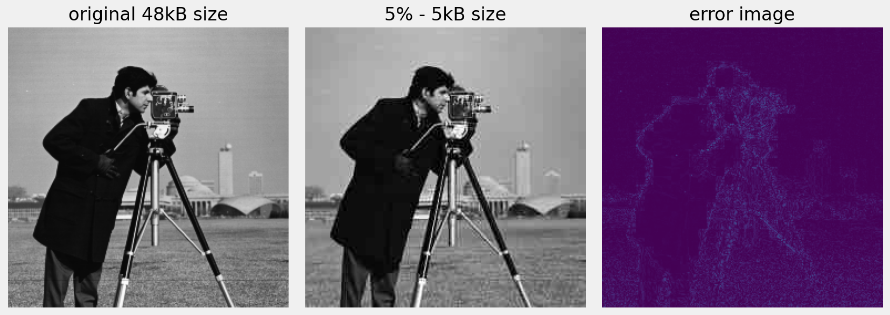

# Content

Lossy and lossless image compression.

- Changing colour spaces and subsampling
- DCT and quantisation
- Run-length encoding
- Entropy coding

::: notes
JPEG compression
:::

# Image Coding

How can we compress an image without _destroying_ the image?

::: incremental

- Data and information are not the same thing.
- Goal is to identify and remove redundancy.

:::

## Lossy or Lossless {data-auto-animate="true"}

Lossless:

- Image can be reconstructed **exactly**.

## Lossy or Lossless {data-auto-animate="true"}

Lossy:

- Inflated image is an _approximation_ of the original.
- How much loss is _acceptable_?

::: notes
how do we decide on acceptable?
:::

## Image Redundancy {data-auto-animate="true"}

Inter-pixel redundancy:

- Neighbouring pixels are related to one another

## Image Redundancy {data-auto-animate="true"}

Coding redundancy:

- Not all pixel intensities are equally likely

## Image Redundancy {data-auto-animate="true"}

Pycho-visual redundancy:

- We are not visually _sensitive_ to everything in the image

# JPEG Compression {data-auto-animate="true"}

::: incremental

- A framework for compressing images.
- Many algorithms can be used in the framework.
- Developed by [Joint Photographic Expert Group](https://jpeg.org).
- JPEG exploits the three forms of redundancy outlined.

:::

::: notes
JPEG is one of most common compression standards
:::

## JPEG Compression {data-auto-animate="true"}

::: notes
The first step is to convert the colour space from RGB to YCbCr.
:::

# $Y C_b C_r$

$$
\begin{aligned}
    Y &= 0.299R + 0.587G + 0.114B \\
    C_b &= B-Y \\
    C_r &= R-Y
\end{aligned}
$$

::: notes
weighted sum of RGB components
blue relative to luminance
red relative to luminance
:::

## Luminance {data-auto-animate="true"}

$$Y = 0.299R + 0.587G + 0.114B$$

Humans are _more_ sensitive to luminance...

## Chrominance {data-auto-animate="true"}

$$
\begin{aligned}
    C_b &= B-Y \\
    C_r &= R-Y
\end{aligned}
$$

Humans are _less_ sensitive to chrominance...

::: notes
100 million rods for luminance
6 million cones for colour
:::

## $Y C_b C_r$ {data-auto-animate="true"}

We can downsample the chrominance channels without affecting the image in a _perceptible_ way.

- Exploits **psycho-visual** redundancy.

## JPEG Compression {data-auto-animate="true"}

# Chroma Subsampling {data-auto-animate="true"}

Subsampling scheme is expressed as a ratio **J:a:b**

- represents a conceptual window on the _chrominance_ channels.

## Chroma Subsampling {data-auto-animate="true"}

- **J**: horizontal sampling reference. Usually, 4.
- **a**: number of pixels in the top row that will have chroma information.
- **b**: number of _changes_ of samples (Cr, Cb) between first and second row of J pixels.

## Chroma Subsampling {data-auto-animate="true"}

::: image

{width=80%}

:::

::: notes
Consider a sample window where J=4, and we have two rows a and b.
:::

## Chroma Subsampling {data-auto-animate="true"}

::: image

{width=100%}

:::

::: notes
Four samples from top row "a", 4 different sample locations from "b", therefore NO compression.
:::

## Chroma Subsampling {data-auto-animate="true"}

::: image

{width=100%}

:::

::: notes
Two samples from top row "a", 2 different sample locations from "b"...
:::

## Chroma Subsampling {data-auto-animate="true"}

::: image

{width=100%}

:::

::: notes
Two samples from top row "a", ZERO different sample locations from "b"...
:::

## JPEG Compression {data-auto-animate="true"}

## JPEG Compression {data-auto-animate="true"}

::: columns

::::: column

:::::

::::: column

:::::

:::

## JPEG Compression {data-auto-animate="true"}

# DCT {data-auto-animate="true"}

Transforms the image into the _frequency domain_.

## DCT {data-auto-animate="true"}

::: notes
lets just follow what happens to some image values in the DCT
:::

## DCT {data-auto-animate="true"}

::: notes
2D DCT coefficients - as we have already discussed in lectures and labs.
:::

## JPEG Compression {data-auto-animate="true"}

::: notes
This part is new to us. Quantising the coefficients.
:::

# DCT Quantisation {data-auto-animate="true"}

Reduce the number of bits needed to store a value by reducing precision.

- Decrease precision as we move away from the top left corner.
- High frequency details usually contribute less to the image.

## DCT Quantisation {data-auto-animate="true"}

Quantisation is performed as follows:

$$DCT_{q}(i, j) = round \left( \frac{DCT(i, j)}{Q(i, j)} \right)$$

where $Q$ is the quantisation matrix.

## DCT Quantisation {data-auto-animate="true"}

{width=50%}

::: notes
Quantisation matrix is a 2D array of values. The values are decided empirically or by subjective judgement, although there are now well defined examples.
:::

## DCT Quantisation {data-auto-animate="true"}

## DCT Quantisation {data-auto-animate="true"}

{width=50%}

## JPEG Compression {data-auto-animate="true"}

::: notes
zig zag scan - recall the location of the most significant coefficients.
:::

## ZigZag Scan {data-auto-animate="true"}

{width=50%}

## ZigZag Scan {data-auto-animate="true"}

{width=50%}

## ZigZag Scan {data-auto-animate="true"}

::: columns
::::: column

:::::
::::: column

$65, -27, -2, 17, -3,$
$19, 0, -3, 8, 0, ...$

:::::
:::

## ZigZag Scan {data-auto-animate="true"}

::: columns
::::: column

:::::
::::: column

Reads from low frequency coefficients to high frequency coefficients...

:::::
:::

## ZigZag Scan {data-auto-animate="true"}

::: columns
::::: column

:::::
::::: column

More likely to encode all non-zeros and all zeros together...

- beneficial for the next step...

:::::
:::

## JPEG Compression {data-auto-animate="true"}

# Run Length Encoding {data-auto-animate="true"}

Extracts series of value and length of runs from sequence of values.

Exploits **inter-pixel** redundancy.

## Run Length Encoding {data-auto-animate="true"}

65 -27 -2 17 -3 -3 1 1 1 -2 1 1 0 -1 1 0 0 0 0 0 0 0 0 0 0 0 0 0 0 0 0 0 0 0

## Run Length Encoding {data-auto-animate="true"}

65 -27 -2 17 -3 -3 1 1 1 -2 1 1 0 -1 1 0 0 0 0 0 0 0 0 0 0 0 0 0 0 0 0 0 0 0

65 1 -27 1 -2 1 17 1 -3 2 1 3 -2 1 1 2 0 1 -1 1 1 1 0 19

::: notes
reducing the number of bits needed to store a value by exploiting inter pixel redundancy.
:::

## Run Length Encoding {data-auto-animate="true"}

**65** -27 -2 17 -3 -3 1 1 1 -2 1 1 0 -1 1 0 0 0 0 0 0 0 0 0 0 0 0 0 0 0 0 0 0 0

**65 1** -27 1 -2 1 17 1 -3 2 1 3 -2 1 1 2 0 1 -1 1 1 1 0 19

::: notes
reducing the number of bits needed to store a value by exploiting inter pixel redundancy.
:::

## Run Length Encoding {data-auto-animate="true"}

65 -27 -2 17 **-3 -3** 1 1 1 -2 1 1 0 -1 1 0 0 0 0 0 0 0 0 0 0 0 0 0 0 0 0 0 0 0

65 1 -27 1 -2 1 17 1 **-3 2** 1 3 -2 1 1 2 0 1 -1 1 1 1 0 19

## Run Length Encoding {data-auto-animate="true"}

65 -27 -2 17 -3 -3 1 1 1 -2 1 1 0 -1 1 **0 0 0 0 0 0 0 0 0 0 0 0 0 0 0 0 0 0 0**

65 1 -27 1 -2 1 17 1 -3 2 1 3 -2 1 1 2 0 1 -1 1 1 1 **0 19**

## Run Length Encoding {data-auto-animate="true"}

Exploits inter-pixel redundancy

- the relationship between neighbouring "pixels" in the zigzag scan of the DCT coefficient matrix

## JPEG Compression {data-auto-animate="true"}

# Entropy Coding

Information and data are not the same thing.

- Claude Shannon, (1948). A Mathematical Theory of Communication.

::: notes
Claude Shannon (1948) A Mathematical Theory of Communication.
You might have heard of entropy in discussions about thermodynamic systems.
:::

## {data-auto-animate="true"}

Entropy Coding exploits **coding redundancy**

- not every value is equally likely.

::: notes
JPEG uses _Huffman_ coding for entropy coding
Huffman, David, A. (1952). A Method for the Construction of Minimum-Redundancy Codes.
:::

## {data-auto-animate="true"}

Entropy Coding encodes a sequence with _variable_ length code so that:

- More probable values have fewer bits, and
- less probable values have more bits.

## {data-auto-animate="true"}

The new alphabet requires fewer bits per pixel.

- How many bits do we need?

::: notes
on average
:::

## {data-auto-animate="true"}

**Recall**: the _probability_ of an event is:

$$p_{i} = \frac{N_{i}}{N}$$

## {data-auto-animate="true"}

The _information_ in **bits** is:

$$I_{i} = - \log_{2} p_{i}$$

::: notes
It is measured in bits with log base 2, logs of other bases do have definitions, but we wont cover them.
:::

## {data-auto-animate="true"}

The _entropy_, the smallest possible **mean** symbol length, is:

$$H = - \sum_{i} p_{i} \log_{2} p_{i}$$

## {data-auto-animate="true"}

We can use these properties to develop a better coding for an image.

- The stream must be decoded _unambiguously_.
- One code cannot be the **prefix** of another.

::: notes
Remember: the goal is to develop a variable length code.
In JPEG we use **Huffman** coding for entropy coding.

:::

## Huffman Coding {data-auto-animate="true"}

Step 1:

- Arrange values in order of decreasing probability.
- Each forms a _leaf_ in the **Huffman tree**.

## Huffman Coding {data-auto-animate="true"}

Step 2:

- Merge the two leaves with the smallest probability,
  - _add_ the probabilities,
  - insert the node into the sorted list.
- Assign a 1/0 to each branch being merged.

## Huffman Coding {data-auto-animate="true"}

Step 3:

- Repeat until only the root node remains.
- Read codewords from the root to the leaves.

# Case Study {data-auto-animate="true"}

## Huffman Coding {data-auto-animate="true"}

::: columns
::::: column

:::::
::::: column
What is the Huffman code for this image?

And, what is the current bit rate?
:::::
:::

::: notes
The current bit rate is 3
:::

## {data-auto-animate="true"}

Count the frequencies of each symbol.

::: {style="font-size: 0.7em;"}

| Frequency | Symbol |
| :-------: | :----: |
|     4     |   0    |
|    23     |   1    |
|    15     |   2    |
|     8     |   3    |
|    10     |   4    |
|    29     |   5    |
|     2     |   6    |
|     9     |   7    |

:::

## {data-auto-animate="true"}

What is the **entropy** of this image?

::: {style="font-size: 0.7em;"}

| $p(s)$ | $-\log p(s)$ | $\times$  |
| :----: | :----------: | :-------: |
|  0.29  |    1.786     |   0.518   |
|  0.23  |    2.120     |   0.488   |
|  0.15  |    2.737     |   0.411   |
|  0.10  |    3.322     |   0.332   |
|  0.09  |    3.474     |   0.313   |
|  0.08  |    3.644     |   0.292   |
|  0.04  |    4.644     |   0.186   |
|  0.02  |    5.644     |   0.113   |
|        |     $+$      | **2.651** |

:::

## {data-auto-animate="true"}

Sort by the most frequent symbol.

::: {style="font-size: 0.7em;"}

| Frequency | Symbol |
| :-------: | :----: |
|    29     |   5    |
|    23     |   1    |
|    15     |   2    |
|    10     |   4    |
|     9     |   7    |
|     8     |   3    |
|     4     |   0    |
|     2     |   6    |

:::

## {data-auto-animate="true"}

Merge the two leaves with the lowest frequency...

{width=65%}

## {data-auto-animate="true"}

Insert the node into the sorted list.

::: {style="font-size: 0.7em;"}

| Frequency | Symbol |
| :-------: | :----: |
|    29     |   5    |
|    23     |   1    |
|    15     |   2    |
|    10     |   4    |
|     9     |   7    |
|     8     |   3    |
|     6     |   \*   |

:::

## {data-auto-animate="true"}

Repeat with the next two lowest frequencies.

{width=65%}

## {data-auto-animate="true"}

Insert the node into the sorted list.

::: {style="font-size: 0.7em;"}

| Frequency | Symbol |
| :-------: | :----: |
|    29     |   5    |
|    23     |   1    |
|    15     |   2    |
|    14     |   \*   |
|    10     |   4    |
|     9     |   7    |

:::

## {data-auto-animate="true"}

Repeat with the next two lowest frequencies.

{width=65%}

## {data-auto-animate="true"}

Continue until the tree is complete.

{width=65%}

## {data-auto-animate="true"}

Label left branches with **0**, right branches with **1**.

{width=65%}

## {data-auto-animate="true"}

Read from the **root** to compute the new codes.

::: {style="font-size: 0.7em;"}

| Code  | Symbol |
| :---: | :----: |
| 11001 |   0    |
|  01   |   1    |
|  111  |   2    |
| 1101  |   3    |
|  001  |   4    |
|  10   |   5    |
| 11000 |   6    |
|  000  |   7    |

:::

::: notes
no code is a prefix of another
:::

## {data-auto-animate="true"}

::: columns
::::: {.column style="font-size:0.6em"}

| Value | p(x) | code length | $\times$ |
| :---: | :--: | :---------: | :------: |
|   5   | 0.29 |      2      |   0.58   |
|   1   | 0.23 |      2      |   0.46   |
|   2   | 0.15 |      3      |   0.45   |
|   4   | 0.10 |      3      |   0.30   |
|   7   | 0.09 |      3      |   0.27   |
|   3   | 0.08 |      4      |   0.32   |
|   0   | 0.04 |      5      |   0.20   |
|   6   | 0.02 |      5      |   0.10   |
|       |      |      +      | **2.68** |

:::::
::::: column
We can calculate the bit rate we achieved.

::: incremental

- Not optimal.
- optimal bit rate is $2.65$
- our bit rate is $2.68$
- The compression ratio is $2.68/3.0 = 0.8933$.

:::

:::::
:::

## JPEG Compression {data-auto-animate="true"}

# Lossy Compression

## JPEG Compression {data-auto-animate="true"}

## JPEG Compression {data-auto-animate="true"}

## JPEG Compression {data-auto-animate="true"}

# Summary

Three types of redundancy are exploited in image compression.

::: incremental

- psycho-visual redundancy
- inter-pixel redundancy
- coding redundancy
- **JPEG** uses them all.

:::

::: notes
JPEG uses them all.
:::
