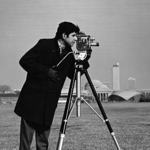
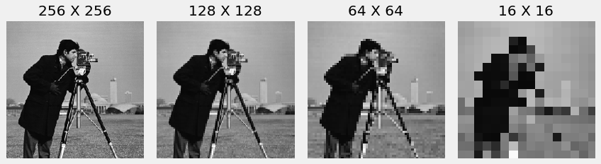

# Content

- Introducing Images
- Sampling and Quantisation
- Image Capture
- Controlling and Analysing Images
- Video

# Images

Arguably the most important scientific instrument to date,
practical photography with a camera arrived in 1839.

Simultaneously claimed by Louis Daguerre and
William Henry Fox Talbot,
and preceded by far less useful solutions.

---

::: columns
::::: column

:::::
::::: {.column width=60%}

### Eadweard Muybridge 1830-1904

Proved a galloping horse lifts all four hooves off the ground at one point in its sequence of motion.

:::::
:::

---

::: notes
Muybridge used a series of photographs to illustrate the horse's motion. He triggered the camera by a series of trip wires.
:::

---

Perhaps the earliest movie?

---

Efficiently describe complex information...

{width=80%}

::: notes
image from wikipedia - CC BY-NC-SA
[link](https://en.wikipedia.org/wiki/Times_Square#/media/File:New_york_times_square-terabass.jpg)
:::

---

::: columns
::::: column

:::::
::::: {.column width=40%}

### Map of the Internet

Image data can contain data other than photographs.

[A map of the Internet in 2021](https://www.halcyonmaps.com/#/map-of-the-internet-2021)

:::::
:::

## Processing Images {data-auto-animate="true"}

## Processing Images {data-auto-animate="true"}

## Processing Images {data-auto-animate="true"}

## Processing Images {data-auto-animate="true"}

::: notes
semantic segmentation, classification and localisation, object detection, instance segmentation.
:::

## Processing Images {data-auto-animate="true"}

- Image enhancement or restoration
- Transmission or storage
- Evidence
- Image understanding or recognition

## Digital Images

How do we represent images on a computer?

## Greyscale Images {data-auto-animate="true"}

::: columns
::::: column

:::::
::::: {.column width=60%}

- 2D _matrix_ of intensity values
- Each value is a single _pixel_
- 0 to 255 for 8 bit images
- 0 is black, 255 is white

:::::
:::

## Greyscale Images {data-auto-animate="true"}

::: columns
::::: column

:::::
::::: {.column width=60%}

- Can be defined as a function $I(x, y)$
- $x, y$ are the _coordinates_ of the pixel
- $I(x, y)$ is the _intensity_ of the pixel

:::::
:::

## **Caveat**

- Data coordinates have the origin at the _lower_ left.
- The origin is at the _top_ left corner for images.
- Indexing 2D matrices is row, column order.

## Colour Images {data-auto-animate="true"}

::: columns
::::: column

:::::
::::: {.column width=60%}

- 3D _matrix_ of intensity values
- Height x Width x Channels
- Each triple value is a single pixel
- (0, 0, 0) is black
- (255, 255, 255) is white

:::::
:::

::: notes
The astonaut's name is Eileen Collins.
:::

## Colour Images {data-auto-animate="true"}

Colour images can be defined as a _set_ of functions:

- $R(x, y)$ for red
- $G(x, y)$ for green
- $B(x, y)$ for blue

## Colour Images {data-auto-animate="true"}

## Colour Images {data-auto-animate="true"}

- Can also allow a definition of transparency.
- Often referred to as _alpha_.
- Still a 3D matrix, but with 4 channels.

::: notes
alpha is also possible for greyscale images.
:::

# Sampling and Quantisation {style="font-size:1.8em;"}

## Sampling and Quantisation

In order to become suitable for digital processing,
an image function $f(x,y)$ must be digitized both spatially and in amplitude.

## Sampling {data-auto-animate="true"}

To digitise an image we discretise it by sampling spatially on a regular grid.

## Sampling {data-auto-animate="true"}

The number of samples determines the **resolution** of the image.

## Sampling {data-auto-animate="true"}

A **pixel** (picture element) at $(x,y)$ is the image intensity at the grid
point indexed by the integer coordinate $(x,y)$.

## Sampling {data-auto-animate="true"}

We can sample the image at various resolutions.

## Sampling {data-auto-animate="true"}

**NOTE:** Here we use bi-cubic interpolation to display the images.

## Sampling {data-auto-animate="true"}

You have already encountered sampling in the context of audio.

In audio the real signal is in the _time_ domain.

For images, the real signal is in the _spatial_ domain.

## Quantisation {data-auto-animate="true"}

#### Definition

Transform a real-valued sampled image to one that takes a finite number of distinct values.

## Quantisation {data-auto-animate="true"}

A pixel is usually represented by 8 bits, representing 256-levels.

- In grayscale 0-255 represent black to white.
- More or fewer bits can be used for a larger or greater range of values.

## Quantisation {data-auto-animate="true"}

# Image Capture

Digital Photography

## The Camera {data-auto-animate="true"}

::: columns
::::: column

:::::
::::: {.column width=60%}

- The **shutter** opens briefly.
- Light enters via the **aperture**.
- The **lens** focuses the rays.
- An image is formed on the **sensor**.

:::::
:::

## The Camera {data-auto-animate="true"}

::: columns
::::: column

:::::
::::: {.column width=60%}

- The sensor comprises millions of **photo-sites**.
- The photo-sites collect photons.
- Sites only measure **brightness**.
- How do we determine color?

:::::
:::

## Bayer Filters {data-auto-animate="true"}

::: columns
::::: column

:::::
::::: {.column width=60%}

- Assign each photo-site a filter.
- Red filter _allows_ red light.
- Red filter _blocks_ blue-green.
- We can separate the intensities of red, blue and green.

:::::
:::

## Bayer Filters {data-auto-animate="true"}

::: columns
::::: column

:::::
::::: {.column width=60%}

- Filtering results in missing values.
- Missing values must be _interpolated_.
- Manufacturers have their own algorithms.
- Simplest method is linear interpolation.

:::::
:::

## Bayer Interpolation {data-auto-animate="true"}

::: columns
::::: column

:::::
::::: column

- $a = (r_1 + r_2 + r_3 + r_4) / 4$
- $b = (r_2 + r_4) / 2$
- $a = (r_3 + r_4) / 2$

:::::
:::

## Bayer Interpolation {data-auto-animate="true"}

::: columns
::::: column

:::::
::::: column

:::::
:::

::: notes
http://www.red.com/learn/red-101/bayer-sensor-strategy
:::

## Colour Perception {data-auto-animate="true"}

::: columns
::::: column

:::::
::::: {.column width=65%}

- Twice as many green pixels.
- Less noise than uniform distribution.
- Humans are more sensitive to green.

:::::
:::

## Colour Perception {data-auto-animate="true"}

Colour is not a physical phenomenon - it is how humans perceive
light of different wavelengths (analogous to perception of
frequency in audio waveforms)

## Colour Perception {data-auto-animate="true"}

::: columns
::::: column

:::::
::::: column

Visible spectrum and receptor response for "normal" vision.

- S: Short cone response
- M: Medium cone response
- L: Long cone response

:::::
:::

## Colour Perception {data-auto-animate="true"}

::: columns
::::: column

:::::
::::: column

Wavelengths perceived as green trigger both M and L cone cells in the eye.

Abnormalities in the cone response leads to colour blindness.

:::::
:::

# Controlling and Analysing Colour

## Exposure {data-auto-animate="true"}

Exposure controls the _brightness_ of an image.

## Pre-image capture

Adjust shutter speed and aperture size to control the amount of light reaching the image sensor.

## Post-image capture

Adjust with a _tone_ curve; a mapping from input to output pixel intensity.

## Tone Curves {data-auto-animate="true"}

As a linear function

### $I^{\prime} = Iw + b$

## Tone Curves {data-auto-animate="true"}

As a linear function

### $I^{\prime} = Iw + b$

### **Caution**

Beware of implicit type conversion in your code.

## Linear Tone Curves {data-auto-animate="true"}

::: columns
::::: column

:::::
::::: {.column width=60%}

$$f(I) = I$$

:::::
:::

## Linear Tone Curves {data-auto-animate="true"}

::: columns
::::: column

:::::
::::: {.column width=60%}

$$f(I) = I$$

- Output intensity is the same as input intensity
- No change is made to the image

:::::
:::

## Linear Tone Curves {data-auto-animate="true"}

{width=100%}

## Linear Tone Curves {data-auto-animate="true"}

::: columns
::::: column

:::::
::::: {.column width=60%}

$$f(I) = I \times 0.7$$

:::::
:::

## Linear Tone Curves {data-auto-animate="true"}

::: columns
::::: column

:::::
::::: {.column width=60%}

$$f(I) = I \times 0.7$$

- Output intensity is less than input intensity
- The image appears darker
- Higher input values are effected more than lower input values

:::::
:::

## Linear Tone Curves {data-auto-animate="true"}

{width=100%}

## Linear Tone Curves {data-auto-animate="true"}

::: columns
::::: column

:::::
::::: {.column width=60%}

$$f(I) = I \times 0.5 + 90$$

:::::
:::

## Linear Tone Curves {data-auto-animate="true"}

::: columns
::::: column

:::::
::::: {.column width=60%}

$$f(I) = I \times 0.5 + 90$$

- Low input values are increased.
- High input values are decreased.
- The image appears to have _lower_ contrast.

:::::
:::

## Linear Tone Curves {data-auto-animate="true"}

{width=100%}

## Linear Tone Curves {data-auto-animate="true"}

::: columns
::::: column

:::::
::::: {.column width=60%}

$$f(I) = I \times 1.6 - 90$$

:::::
:::

## Linear Tone Curves {data-auto-animate="true"}

::: columns
::::: column

:::::
::::: {.column width=60%}

$$f(I) = I \times 1.6 - 90$$

- High input values are increased.
- Low input values are decreased.
- The image appears to have _higher_ contrast.
- Some input values are _clipped_.

:::::
:::

## Linear Tone Curves {data-auto-animate="true"}

{width=100%}

## Gamma Correction {data-auto-animate="true"}

Our eyes perceive brightness on a **logarithmic** scale.

Similar to how we perceive loudness in audio.

## Gamma Correction {data-auto-animate="true"}

We have more cells that see in dim light than those that see in bright light.

We are more _sensitive_ to low light changes.

## Gamma Correction {data-auto-animate="true"}

Cameras measure light on a **linear** scale.

## Gamma Correction {data-auto-animate="true"}

Tone curves can be used to adjust images so that they more closely
match human perception of a scene.

## $$I^{\prime} = 255 \times \frac{I}{255}^{\frac{1}{\gamma}}$$

## Gamma Correction {data-auto-animate="true"}

::: columns
::::: column

:::::
::::: {.column width=60%}

$$I^{\prime} = 255 \times \frac{I}{255}^{\frac{1}{\gamma}}$$

- End points are unchanged.
- If $\gamma = 1$, image is unchanged.
- If $\gamma > 1$, image appears lighter.
- If $\gamma < 1$, image appears darker.

:::::
:::

## Gamma Correction {data-auto-animate="true"}

{width=100%}

## Histograms {data-auto-animate="true"}

A histogram is an approximate representation of the distribution of numerical data.

## Histograms {data-auto-animate="true"}

We want to show the frequency, or count, of the values in an image.

## Histograms {data-auto-animate="true"}

{width=100%}

## Histograms {data-auto-animate="true"}

::: columns
::::: column

:::::
::::: {.column width=60%}

- Notice the large cluster of values 5 to 25.
- Probably the coat?

:::::
:::

## Histograms {data-auto-animate="true"}

::: columns
::::: column

:::::
::::: {.column width=60%}

- Notice the central values.
- 100 to 150 could be grass?
- 150 to 200 could be sky?

:::::
:::

## Thresholding {data-auto-animate="true"}

**Thresholding** is the simplest method of segmenting images.

## Thresholding {data-auto-animate="true"}

If we wanted to separate the coat from the sky, we could use a threshold.

## Thresholding {data-auto-animate="true"}

By observing the histogram we could separate all pixels above or below a value.

## Thresholding {data-auto-animate="true"}

$$I_{t} = I > t$$

## Thresholding {data-auto-animate="true"}

# Video

We can consider video as a sequence of consecutive images.

## Frame Rate (fps) {data-auto-animate="true"}

The rate at which images are captured - or displayed.

## Frame Rate (fps) {data-auto-animate="true"}

- 24 fps common for the film industry.
- 25 fps common for the European television industry.
- 29.97 fps common for the American television industry.
- 90 fps common for the virtual reality headsets.

## Progressive Scan

- All lines of each frame are drawn in sequence.
- The whole image is drawn at before transmission.

## Interlaced Scan {data-auto-animate="true"}

- Odd and even lines are broadcast on alternating frames.
- display device interleaves fields.
- Eye fooled into believing image is being updated, so less apparent flicker.
- Many unpleasant artefacts introduced as a result of interlacing.

## Interlaced Scan {data-auto-animate="true"}

# Summary

- Introducing images
- Image Sampling and Quantisation
- Image Capture
- Controlling and Analysing Images
- Video
