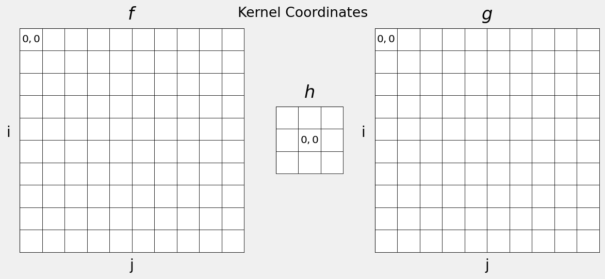
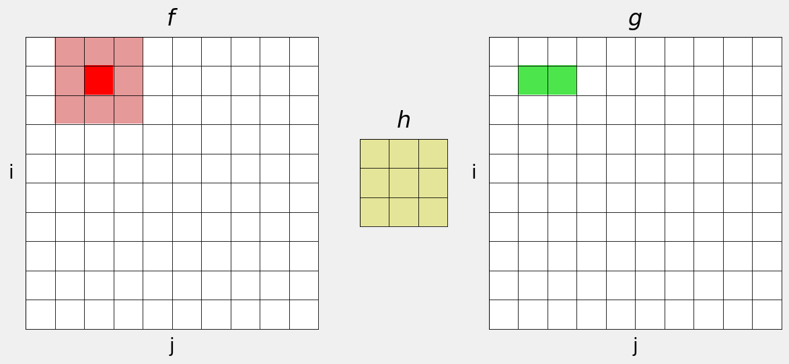
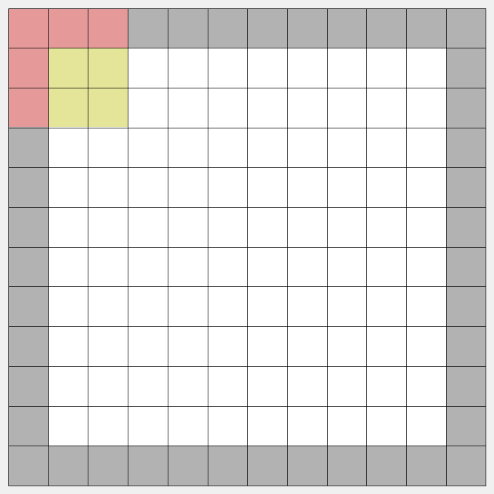

# Content

- 2D Convolutions
- Smoothing Filter
- Sharpening and Unsharp Masking
- Template Matching

## What is Image Filtering? {data-auto-animate="true"}

Filtering replaces each pixel with a value based on some function performed on it’s local neighbourhood.

## What is Image Filtering? {data-auto-animate="true"}

Used for smoothing and sharpening.

IMAGE HERE

## What is Image Filtering? {data-auto-animate="true"}

Estimating gradients.

IMAGE HERE

## What is Image Filtering? {data-auto-animate="true"}

Removing noise.

IMAGE HERE

## Linear Filtering

Linear Filtering is defined as a convolution.

This is a _sum of products_ between an image region and a **kernel** matrix:

$$g(i, j) = \sum_{m=-a}^{a}\sum_{n=-b}^{b} f(i - m, j - n) h(m, n)$$

where $g$ is the filtered image, $f$ is the original image, $h$ is the kernel, and $i$ and $j$ are the image coordinates.

## Convolution

Typically:

$$a=\lfloor \frac{h_{rows}}{2} \rfloor, ~ b=\lfloor \frac{h_{cols}}{2} \rfloor$$

So for a 3x3 kernel:

$$ \text{both } m, n = -1, 0, 1$$

## Convolution

Kernel matrix coordinate origin is in the _centre_.

::: notes
Recall: the image coordinate origin is in the top left.
:::

## Convolution {data-auto-animate="true"}

1. Scan image with a sub-window centred at each pixel.

   - The sub-window is known as the kernel, or mask.

2. Replace the pixel with the sum of products between the kernel coefficients and all of the pixels beneath the kernel.

   - Sum of products only for linear filters

3. Slide the kernel so it’s centred on the next pixel and repeat for all pixels in the image.

## Convolution {data-auto-animate="true"}

## Convolution {data-auto-animate="true"}

## Convolution {data-auto-animate="true"}

## Convolution {data-auto-animate="true"}

## Convolution {data-auto-animate="true"}

## Convolution {data-auto-animate="true"}

## Convolution {data-auto-animate="true"}

## Convolution {data-auto-animate="true"}

## Convolution {data-auto-animate="true"}

## Convolution {data-auto-animate="true"}

## Convolution {data-auto-animate="true"}

## Convolution {data-auto-animate="true"}

## Images Edges

{width=55%}

## More Kernel Examples

There is a nice interactive tool to view kernel operations here:
[https://setosa.io/ev/image-kernels/](https://setosa.io/ev/image-kernels/)
