# Content

- 2D Convolutions
- Smoothing Filters
- Sharpening and Unsharp Masking
- Template Matching

## What is Image Filtering? {data-auto-animate="true"}

Filtering replaces each pixel with a value based on some function performed on it’s local neighbourhood.

## What is Image Filtering? {data-auto-animate="true"}

Used for smoothing and sharpening.

## What is Image Filtering? {data-auto-animate="true"}

Estimating gradients.

## What is Image Filtering? {data-auto-animate="true"}

Removing noise.

## Linear Filtering

Linear Filtering is defined as a convolution.

This is a _sum of products_ between an image region and a **kernel** matrix:

$$g(i, j) = \sum_{m=-a}^{a}\sum_{n=-b}^{b} f(i - m, j - n) h(m, n)$$

where $g$ is the filtered image, $f$ is the original image, $h$ is the kernel, and $i$ and $j$ are the image coordinates.

## Convolution

Typically:

$$a=\lfloor \frac{h_{rows}}{2} \rfloor, ~ b=\lfloor \frac{h_{cols}}{2} \rfloor$$

So for a 3x3 kernel:

$$ \text{both } m, n = -1, 0, 1$$

::: notes
Kernel does not need to be square - but often are.
:::

## Kernel Matrix

::: notes
Recall: the image coordinate origin is in the top left.
:::

## Convolution {data-auto-animate="true"}

1. Scan image with a sub-window centred at each pixel.

   - The sub-window is known as the kernel, or mask.

2. Replace the pixel with the sum of products between the kernel coefficients and all of the pixels beneath the kernel.

   - Sum of products only for linear filters

3. Slide the kernel so it’s centred on the next pixel and repeat for all pixels in the image.

## Convolution {data-auto-animate="true"}

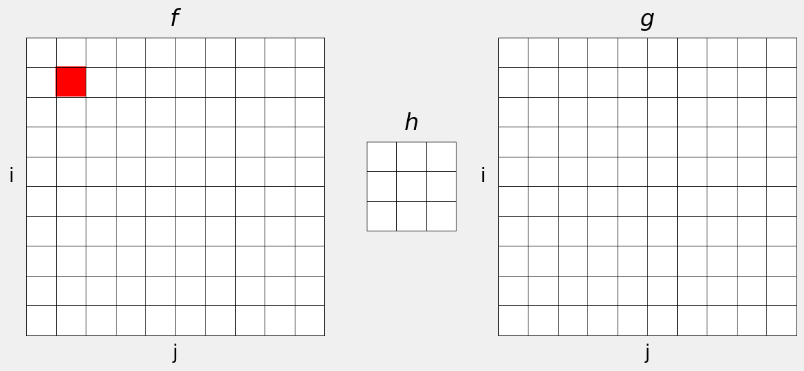

## Convolution {data-auto-animate="true"}

## Convolution {data-auto-animate="true"}

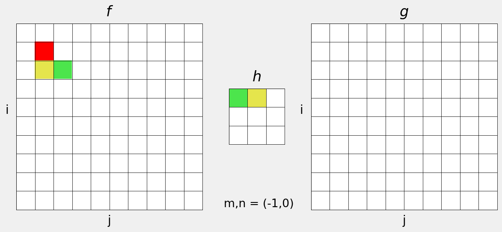

## Convolution {data-auto-animate="true"}

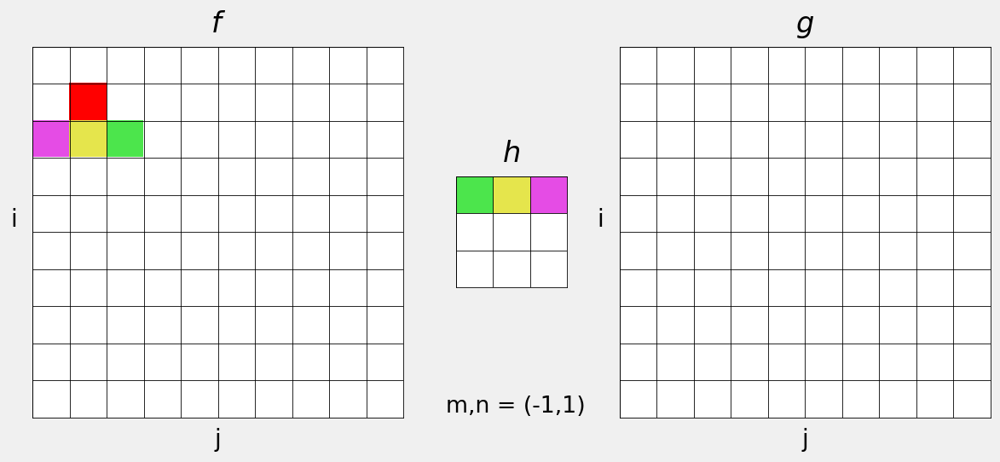

## Convolution {data-auto-animate="true"}

## Convolution {data-auto-animate="true"}

## Convolution {data-auto-animate="true"}

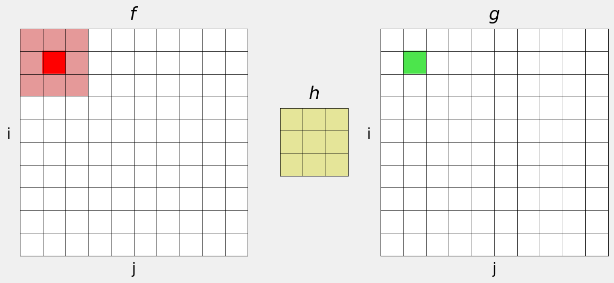

## Convolution {data-auto-animate="true"}

## Convolution {data-auto-animate="true"}

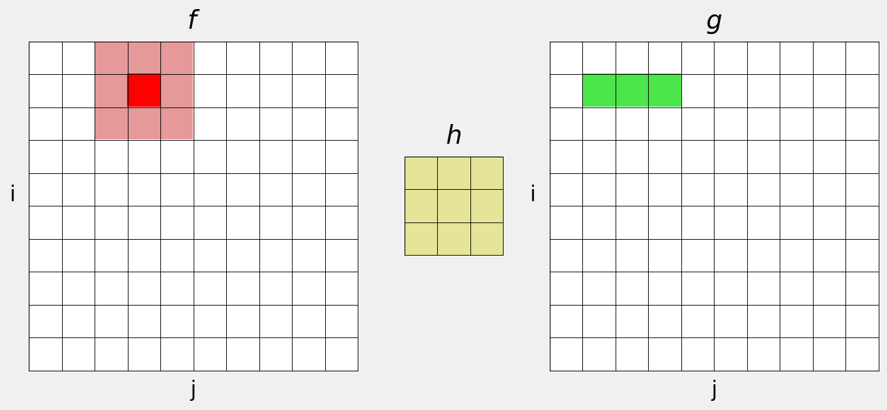

## Convolution {data-auto-animate="true"}

## Convolution {data-auto-animate="true"}

## Convolution {data-auto-animate="true"}

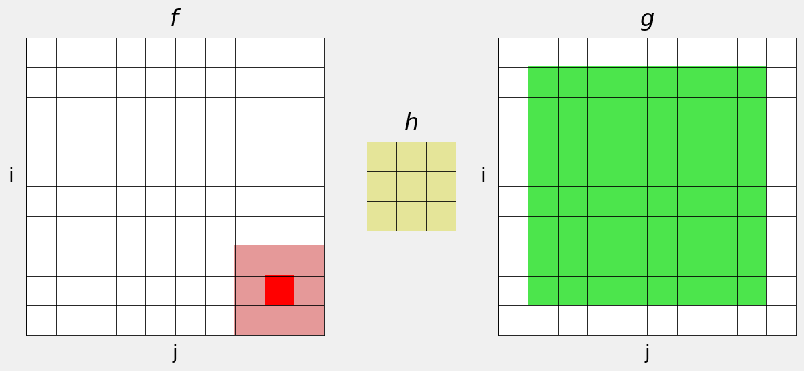

## What about the edges? {data-auto-animate="true"}

::: columns
::::: column

:::::
::::: column

The filter window falls off the edge of the image.

:::::
:::

## What about the edges? {data-auto-animate="true"}

::: columns
::::: column

:::::
::::: column

A common strategy is to pad with zeros.

The image is effectively larger than the original.

:::::
:::

## What about the edges? {data-auto-animate="true"}

::: columns
::::: column

:::::
::::: column

We could _wrap_ the pixels, from each edge to the opposite.

Again, the image is effectively larger.

:::::
:::

## What about the edges? {data-auto-animate="true"}

::: columns
::::: column

:::::
::::: column

Alternatively, we could _repeat_ the pixels, extending each edge outward.

:::::
:::

# Linear Kernels

---

What would the filtered image look like?

---

No change!

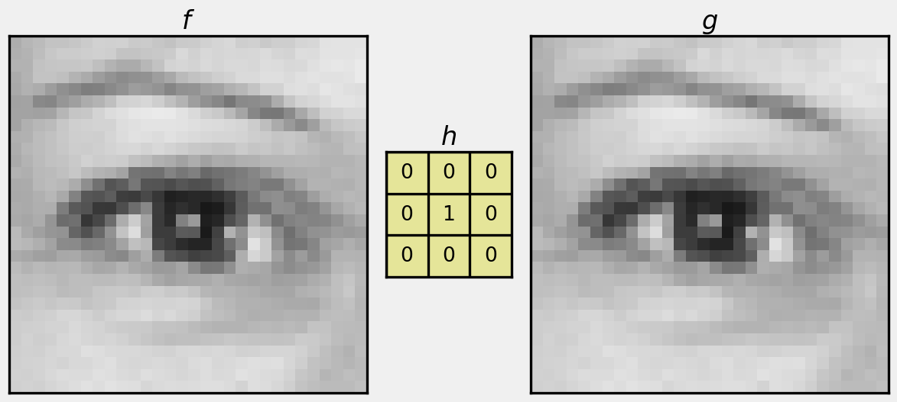

---

What would the filtered image look like?

---

Shifted left by 1 pixel.

---

What would the filtered image look like?

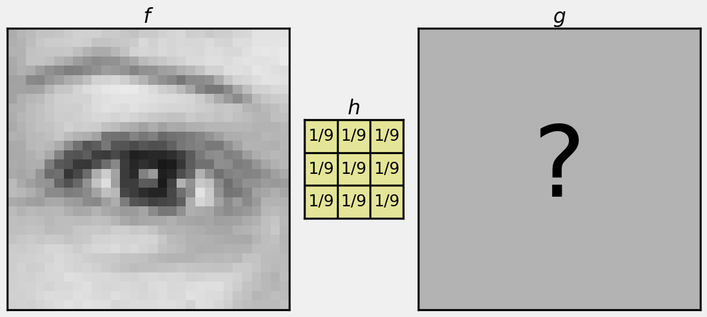

---

Blurred...

# Smoothing Filters

## Mean Filter {data-auto-animate="true"}

replace each pixel with the mean of local neighbours:

$$
h = \frac{1}{9}\times
   \begin{bmatrix}
      1 & 1 & 1 \\
      1 & 1 & 1 \\
      1 & 1 & 1
   \end{bmatrix}
$$

## Mean Filter {data-auto-animate="true"}

## Mean Filter {data-auto-animate="true"}

we can increase the size of the kernel to get a smoother image:

$$
h = \frac{1}{25}\times
   \begin{bmatrix}
      1 & 1 & 1 & 1 & 1 \\
      1 & 1 & 1 & 1 & 1 \\
      1 & 1 & 1 & 1 & 1 \\
      1 & 1 & 1 & 1 & 1 \\
      1 & 1 & 1 & 1 & 1
   \end{bmatrix}
$$

## Mean Filter {data-auto-animate="true"}

## Mean Filter {data-auto-animate="true"}

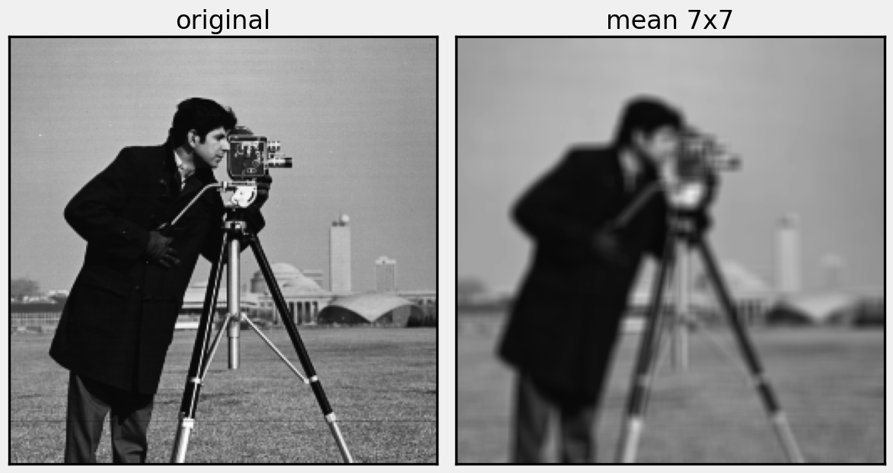

## Gaussian blur {data-auto-animate="true"}

Similar to mean filter:

- Replace intensities with a weighted average of neighbours.
- Pixels closer to the centre of the kernel have more influence.

## Gaussian blur {data-auto-animate="true"}

::: {style="font-size:1.5em"}

$$
g(x,y) = \frac{1}{2\pi\sigma^2}~ {\rm  e}^{ - \frac{x^2+y^2}{2\sigma^2} }
$$

:::

## Gaussian blur {data-auto-animate="true"}

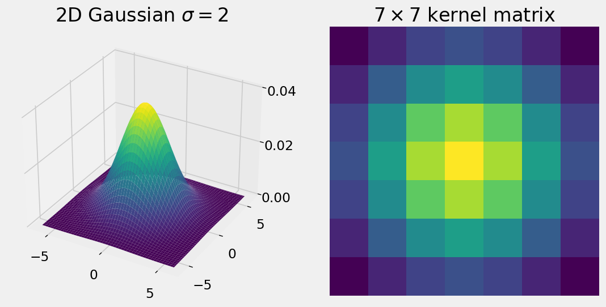

## Gaussian blur {data-auto-animate="true"}

## Image Smoothing

Smoothing effectively _low pass_ filters the image.

- Only really practical for small kernels
- Blurring also destroys image information
- Difference between the mean and Gaussian filter is subtle, but Gaussian is usually preferred

::: notes
Dampens high frequency information so that edges and noise are less prominent
:::

## Image Smoothing

If we have many images of the same scene:

- Use idea of averaging to reduce noise.
- Average pixel intensities across images rather than across the spatial neighbour.

## Image Smoothing

- Effectively increases the signal-to-noise ratio.
- Useful in applications where image signal is low.
  - E.g., imaging astronomical objects.

---

What would the filtered image look like?

---

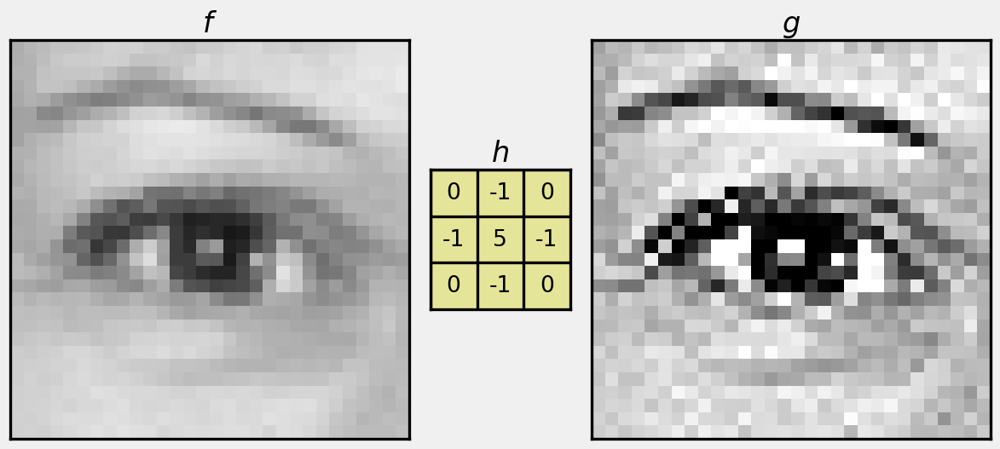

## More Kernel Examples

There is a nice interactive tool to view kernel operations here:
[https://setosa.io/ev/image-kernels/](https://setosa.io/ev/image-kernels/)

# Unsharp Masking

A _high pass_ filter formed from a _low pass_ filtered image.

# Unsharp Masking

Low pass filter removes high-frequency detail.

::: incremental

- Difference between original and filtered images is what the filter removed.
  - high frequency information.
- Add difference to original image to enhance edges, etc.

:::

::: notes

Known as unsharp masking.

:::
