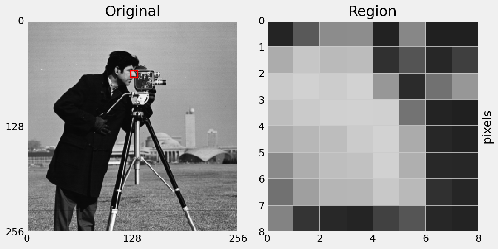

# Content

- Order Statistics filters
- Morphological filtering
- Morphological operations for object detection
- Morphological operations for edge detection

# Order-Statistics Filters

Linear filters compute the sum of products between kernel coefficients and the image neighbourhood.

Instead, replace intensity with a measure obtained by ordering the pixel intensities in the neighbourhood.

- Common filters are **median**, **max** and **min**.

##

Crop a part of a larger image to uses as an example.

##

First, window a region of size 3x3:

##

Sort the intensities in the region:

##

Sort the intensities in the region, and select the middle value:

##

Max filter is similar to median filter, but selects the maximum value:

##

Min filter is again similar, but selects the minimum value:

##

Order-statistics filters are good for noise removal where:

- Noise is random
- Noise is not dependent on surrounding pixels

For example, the salt and pepper noise model:

- Noisy pixels are the outliers in the local neighbourhood
- Replace outliers with estimate from image data

---

_Aside_: What is salt and pepper noise?

- Also called impulse noise.
- Can be hardware dependent - hot pixels or dead pixels.
- Artificially applied by random selecting a subset of pixels and setting to black or white.

## Median Filter

## Median Filter

## Median Filter

## Median Filter

{width=50%}

## Median Filter

::: notes
You might think that a gaussian blur would be a good alternative to a median filter.
Let's look closely at the difference between the two.
:::

## Noise removal {data-auto-animate="true"}

::: columns
::::: column

:::::
::::: column
If we consider this 5 pixel neighbourhood, what will the median filter do?
:::::
:::

## Noise removal {data-auto-animate="true"}

::: columns
::::: column

:::::
::::: column
The median filter removes spike noise.

::: incremental

- What will the gaussian filter do?

:::
:::::
:::

## Noise removal {data-auto-animate="true"}

::: columns
::::: column

:::::
::::: column
The Gaussian filter amplifies noise.
:::::
:::

# Morphological Filters

::: notes
One of the issues we will have to deal with is noise in binary images.
We could consider min and max filters for this - but I'd like to introduce morphological filters for that task.
:::

## Morphological Filters

Operation of the filter is characterised by mathematical morphology.

::: incremental

- Embedded in set theory.
- Useful for thickening and thinning edges and de-noising binary images

:::

::: notes
We will consider only binary images.
The notation gets messy beyond this!
:::

## Motivation

::: notes
Useful for cleaning up binary images.
:::

## Morphological Filters

For binary images:

::: incremental

- White pixels (with intensity 1) can be considered elements in a set.
- Black pixels (with intensity 0) can be considered elements outside of the set.
- Morphological filters are essentially set operations.

:::

## Set Notation {data-auto-animate="true"}

$$\text{Let } A \text{ be a set in } \mathbb{Z}^{2}$$

the set of _all integers_ in 2 dimensions...

## Set Notation {data-auto-animate="true"}

$$ a \in A \text{ if } a = (x, y) \text{ is an element of set } A $$

this is the _element_ symbol...

## Set Notation {data-auto-animate="true"}

$$ a \notin A \text{ if } a \text{ is not in } A $$

_not_ in...

## Set Notation {data-auto-animate="true"}

$$ C = \{ w|w = -d, ~ for ~ d \in D \} $$

the set of all $w$ _such that_...

::: notes
The elements of C, are w, which are formed by multiplying the elements of set D by -1

Braces are used to delimit the contents of a set.

:::

## Set Notation {data-auto-animate="true"}

$$\emptyset \text{ is the empty set} $$

## Set Operations {data-auto-animate="true"}

::: columns
::::: column

:::::
::::: column
Given two sets, A and B, the following can be defined:
:::::
:::

## Set Operations {data-auto-animate="true"}

::: columns
::::: column

:::::
::::: column

$$C \subseteq B,  A \nsubseteq B$$

Subset: a set where all members belong to a given set.
:::::
:::

::: notes
C is a subset of B.
A is not a subset of B.
:::

## Set Operations {data-auto-animate="true"}

::: columns
::::: column

:::::
::::: column

$$A \cup B$$

Union: all elements that are either in set A or set B.
:::::
:::

## Set Operations {data-auto-animate="true"}

::: columns
::::: column

:::::
::::: column

$$A \cap B$$

Intersection: all elements that are common to both A and B.
:::::
:::

## Set Operations {data-auto-animate="true"}

::: columns
::::: column

:::::
::::: column

$$A^{c} \{w|w ~\notin ~ A\}$$

Complement: the elements not contained in set A

:::::
:::

## Set Operations {data-auto-animate="true"}

::: columns
::::: column

:::::
::::: column

$$A \setminus B = \{w|w ~\in ~ A,~ w ~\notin ~ B \}$$

Difference: the elements of set A that are not in set B

:::::
:::
::: notes
Sometimes the minus sign is used for set difference...
:::

# Structuring Element

A _binary_ image (or mask) that allows us to define neighbourhood structures.

## Structuring Element

::: incremental

- Can be different sizes: larger structuring elements produce a more extreme effect.
- Can be different shapes: common to use a disk or cross shape.
- Has a defined origin: usually at the centre.

:::

## Structuring Element

::: notes
bold indicates the origin
Zero valued pixels are ignored in structuring elements.
:::

## Structuring Element

A structuring element is said to **fit** the image if,
for each of its pixels set to 1, the corresponding image pixel is also 1.

The _set_ of all displacements such that the image and the structuring element overlap at **every** pixel.

::: notes
When a structuring element is placed in a binary image, each of its pixels is associated with the corresponding pixel of the neighbourhood under the structuring element. The structuring element is said to fit the image if, for each of its pixels set to 1, the corresponding image pixel is also 1. Similarly, a structuring element is said to hit, or intersect, an image if, at least for one of its pixels set to 1 the corresponding image pixel is also 1.
:::

## Structuring Element

A structuring element is said to **hit**, an image if,
at least for one of its pixels set to 1 the corresponding image pixel is also 1.

The _set_ of all displacements such that the image and the structuring element overlap at **any** pixel.

::: notes
When a structuring element is placed in a binary image, each of its pixels is associated with the corresponding pixel of the neighbourhood under the structuring element. The structuring element is said to fit the image if, for each of its pixels set to 1, the corresponding image pixel is also 1. Similarly, a structuring element is said to hit, or intersect, an image if, at least for one of its pixels set to 1 the corresponding image pixel is also 1.
:::

# Morphological Operators

## Dilation

$$A \oplus B = \{ x, y| B_{x, y} \cap \neq \emptyset \} $$

Defines dilation of binary image $A$ by structuring element $B$.

Calculate the binary **OR** of elements in $A$ masked by $B$.

The structuring element _hits_ the image.

::: notes
Move B over A, placing origin at each pixel...
:::

## Dilation {data-auto-animate="true"}

::: columns
::::: column

:::::
::::: column
$$A \oplus B$$

{width=30%}
:::::
:::

## Dilation {data-auto-animate="true"}

::: columns
::::: column

:::::
::::: column

:::::
:::

::: notes
where the structuring element has hit the image - we assign 1 to the output pixel.
:::

## Dilation Example {data-auto-animate="true"}

## Dilation Example {data-auto-animate="true"}

## Dilation

::: incremental

- Expands the size of 1-pixel objects
- Smoothes object boundaries
- Closes holes and gaps
- Regions grow

:::

## Erosion

$$A \ominus B = \{ x, y| B_{x, y} \subseteq A \} $$

Defines erosion of binary image $A$ by structuring element $B$.

Calculate the binary **AND** of elements in $A$ masked by $B$.

The structuring element _fits_ the image.

::: notes
Move B over A, placing origin at each pixel...
:::

## Erosion {data-auto-animate="true"}

::: columns
::::: column

:::::
::::: column
$$A \ominus B$$

{width=30%}
:::::
:::

## Erosion {data-auto-animate="true"}

::: columns
::::: column

:::::
::::: column

:::::
:::

::: notes
where the structuring element fits the image - we assign 1 to the output pixel.
:::

## Erosion Example {data-auto-animate="true"}

## Erosion Example {data-auto-animate="true"}

## Erosion {data-auto-animate="true"}

::: incremental

- Shrinks the size of 1-valued objects.
- Smooths object boundaries.
- Removes peninsulas, fingers, and small objects (such as noise).

:::

::: notes
Erosion is not the inverse of dilation. Although it has the opposite effect.
:::

## Opening {data-auto-animate="true"}

$$A \circ B = (A \ominus B) \oplus B $$

**Erosion** followed by **Dilation**.

- Has the effect of smoothing contours by breaking narrow connections and eliminating thin protrusions.

## Opening Example {data-auto-animate="true"}

## Opening Example {data-auto-animate="true"}

## Closing {data-auto-animate="true"}

$$A \bullet B = (A \oplus B) \ominus B $$

**Dilation** followed by **Erosion**.

- Has the effect of smoothing contours by filling narrow gulfs, holes and small gaps.

## Closing Example {data-auto-animate="true"}

## Closing Example {data-auto-animate="true"}

## QUESTION? {data-auto-animate="true"}

After performing **dilation** of A by B, what does the resulting binary image look like?

::: notes
you might want to start by asking me a question...
:::
