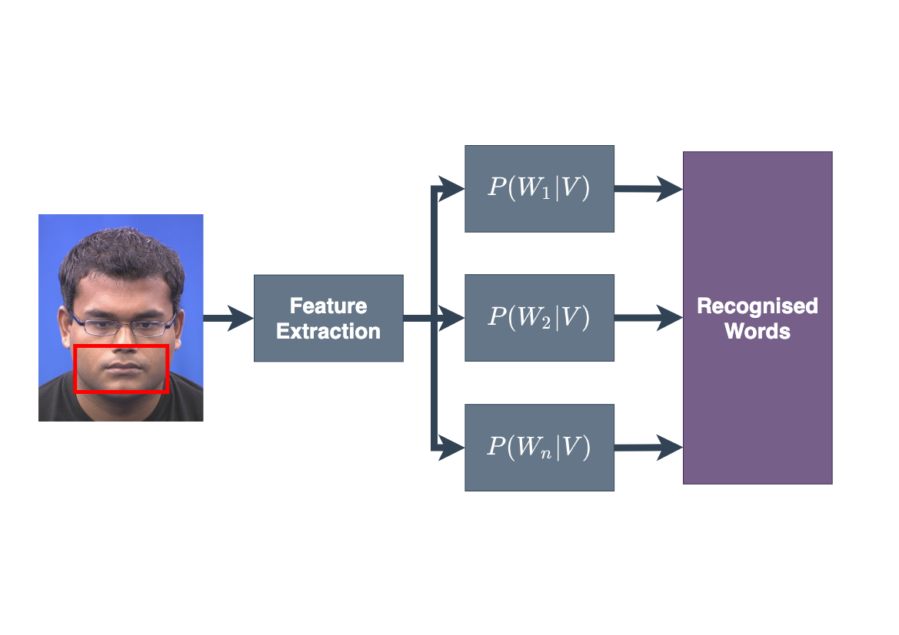
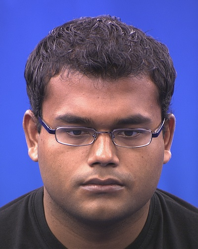

# Content

- Speech recognition models
- Visual Features
- Image segmentation
- Point distribution models
- Fourier descriptors

# Speech Recognition Models

## Acoustic Speech Recognition

The task of a speech recogniser is to determine the most likely word sequence given a new sequence of (acoustic) feature vectors.

::: notes
Lets just remind ourselves about the acoustic speech recognition process...
:::

## Acoustic Speech Recognition

An elegant way to compute this is using hidden Markov models.

## Acoustic Speech Recognition

$$ P(W | Y) = \frac{P(Y | W) P(W)}{P(Y) } $$

::: notes
Probability of a word sequence W given an acoustic observation Y
:::

## Acoustic Speech Recognition

Learn the parametric model from training data, and use to estimate the probabilities.

## Acoustic Speech Recognition

## Visual Speech Recognition

::: notes
Probability of a word sequence W given an visual observation V
:::

## Audio-Visual Speech Recognition

Combine two modalities using:

- Late Integration
- Early Integration

## Late Integration

Late integration builds two separate models and weights their
probabilities to provide the recognised word sequence.

## Late Integration

Has been shown to offer better performance than early integration.

Not straightforward to weight output probabilities.

<cite> 
An investigation of HMM classifier combination strategies for improved audio-visual speech recognition. Lucey et al. 2001
</cite>

## Late Integration

::: notes
Late Integration
:::

## Early Integration

Concatenate the acoustic and visual models to form a single model.

Visual features often need interpolation to align with the acoustic features.

## Early Integration

::: notes
Early Integration
:::

# Visual Features

## Visual Features

MFCCs are the standard features used in acoustic speech recognition.

- What is the equivalent for visual speech?
- In short: there is little agreement!

## Visual Features

Typical features include:

- Shape-based features
- Appearance-based features
- Hybrid features

## Region of Interest (ROI) {data-auto-animate="true"}

::: columns

::::: column

:::::

::::: column
For any form of visual feature extraction, some form of localisation is required.
:::::

:::

## Region of Interest (ROI) {data-auto-animate="true"}

::: columns

::::: column

:::::

::::: column
Where in the image is the face?
:::::

:::

## Region of Interest (ROI) {data-auto-animate="true"}

::: columns

::::: column

:::::

::::: column
Where are the facial features of interest?
:::::

:::

## Region of Interest (ROI) {data-auto-animate="true"}

::: columns

::::: column

:::::

::::: column
MATLAB has an implementation of the Viola Jones face tracker.
:::::

:::

# Shape Features

## Shape Features for Recognition

- Shape features _might_ include:
  - Articulatory-based features, such as mouth height and width
  - Point distribution model (and related features)
  - Fourier descriptors

## Shape Features for Recognition

- There is a trade-off between ease of extraction and the amount of information extracted.
  - Sparse point sets are easier to locate, but capture less information
  - Denser point sets are information rich, but require more a sophisticated capture process

## Representing Shapes

We need a method for describing specific shapes in images.

## Representing Shapes

::: columns
::::: column

:::::
::::: column
An edge detector will locate edges in an image.
:::::
:::

## Representing Shapes

::: columns
::::: column

:::::
::::: column
Which belong to the object of interest?

How are these allowed to vary as the object deforms?
:::::
:::

## Representing Shapes

::: columns
::::: column

:::::
::::: column

### Idea

Can we represent shapes using the image coordinates of the edge pixels?

:::::
:::

## Representing Shapes

We could, but the same shape in two locations will have different coordinates.

The coordinates describe the shape in the image coordinate frame, so they encode the shape **and the location** of the shape.

## Representing Shapes

We are not interested in **where** the shape is — just the shape itself.

- A lip-reading system might use the shape of the lips to recognise speech, but it should not matter where in the image the lips are.

## Representing Shapes

The primary problem is how to segment the lips from the background to extract a representation of the shape that is independent of image location.

A pre-processing stage of feature extraction identifies the region of the image that corresponds to the mouth.

This results in a binary mask, which is 1 if a pixel represents the mouth and 0 otherwise.

# Image Segmentation

The goal of image segmentation is to classify each pixel as being either foreground or background.

::: notes
mouth is foreground for us
:::

## Image Segmentation

We require three things:

1. A property that we can measure from the image pixels (e.g. colour).
2. A distance measure that defines how close two pixels are given that property.
3. A classifier that can discriminate one class from another using that distance.

## Image Segmentation

::: columns
::::: column
Which colour-space should be used?
:::::
::::: column

:::::
:::

## Image Segmentation

::: columns
::::: column

:::::
::::: column

:::::
:::

## Image Segmentation

::: columns
::::: column

:::::
::::: column

$$I = [\frac{r}{r+b+g} \frac{g}{r+b+g} \frac{b}{r+b+g}]$$

- A colour is represented by its proportion of red, green and blue, not the intensity of each.
- Reduces distortions caused by lights and shadows in an image.

:::::
:::

## Image Segmentation

::: columns
::::: column

:::::
::::: column

What colour do we want to segment out?

:::::
:::

## Image Segmentation

::: columns
::::: column

:::::
::::: column

Find the mean colour of a lip pixel:

$$\begin{bmatrix} \mu_{r} \\ \mu_{g} \\ \mu_{b} \end{bmatrix} = \mu_{c}$$

:::::
:::

## Image Segmentation

Find the distance between each pixel in the image, $~I_{i, j}$, and the mean lip pixel colour $~\mu_{c}$.

$$D_{i, j} = \sqrt{\sum{(I_{i, j} -  \mu_{c})^2}} $$

## Image Segmentation

The Euclidean distance between colour at row i, column j and the mean lip colour.

$$D_{i, j} = \sqrt{\sum{(I_{i, j} -  \mu_{c})^2}} $$

A better distance metric might consider the variance of the lip pixels rather
than just the mean, e.g. _Mahalanobis_ distance.

## Image Segmentation

Threshold the distance to segment lips from the background.

$$T_{i, j} = \begin{cases}1 ~ if ~ D_{i, j} < \tau \\ 0 ~ otherwise \end{cases}$$

## Image Segmentation

::: columns
::::: column

:::::
::::: column

:::::
:::

## Image Segmentation

- This approach assumes that there is nothing in the image that is the same colour as the lips, otherwise there is nothing to tell these regions apart.

- Often do other pre-processing (e.g. Viola-Jones face detector) first.

## Image Segmentation

- Need to set the threshold, which itself is not trivial.
- If the threshold is too low, lip pixels will be missing.
- If the threshold is too high, background will be accepted as foreground.

## Image Segmentation

The matte will still contain spurious pixels, which might need cleaning up using **morphological** filtering.

## Image Segmentation

- From the resultant binary mask, the relevant features still need to be extracted.
  - e.g. articulatory-based features...

## Articulatory-based Features

::: columns
::::: column

:::::
::::: column

From the binary image we can extract features such as:

- the height and width of the mouth region
- the number of pixels within the mouth region
- the mouth centroid

:::::
:::

## Image Segmentation

Automated approaches are attractive as there is no manual effort. However:

- The colour of the lips is often similar to the surrounding skin.
- Noise is an issue.
- The facial appearance can change over time (e.g. beard growth, etc.).

## Image Segmentation

Semi-automated approaches are generally more robust.

- They might need significant effort to reliably construct the model.
- But priors can be imposed on the expected shape.
