# Content

- Speech Production
- Visual Speech
- Visemes
- Coarticulation

# Speech Production

in a visual context

## Speech Production {data-auto-animate="true"}

Speech can be regarded as a _filtering_ process.

::: incremental

- Air is expelled from the lungs.
  - the excitation signal
- This air is forced through the vocal tract.
  - the filter
- The air exits via the nose and mouth.
  - the filtered signal

:::

## Speech Production {data-auto-animate="true"}

The filter _response_ is determined by the vocal tract **shape**,
which is dependent on the position of the speech **articulators**.

::: incremental

- The filter is non-stationary since the response changes over time.
- Speech is time-varying in nature.

:::

---

::: notes
source: https://sail.usc.edu/span/gallery.html
:::

## {data-auto-animate="true" data-background-color="#DCDCDC"}

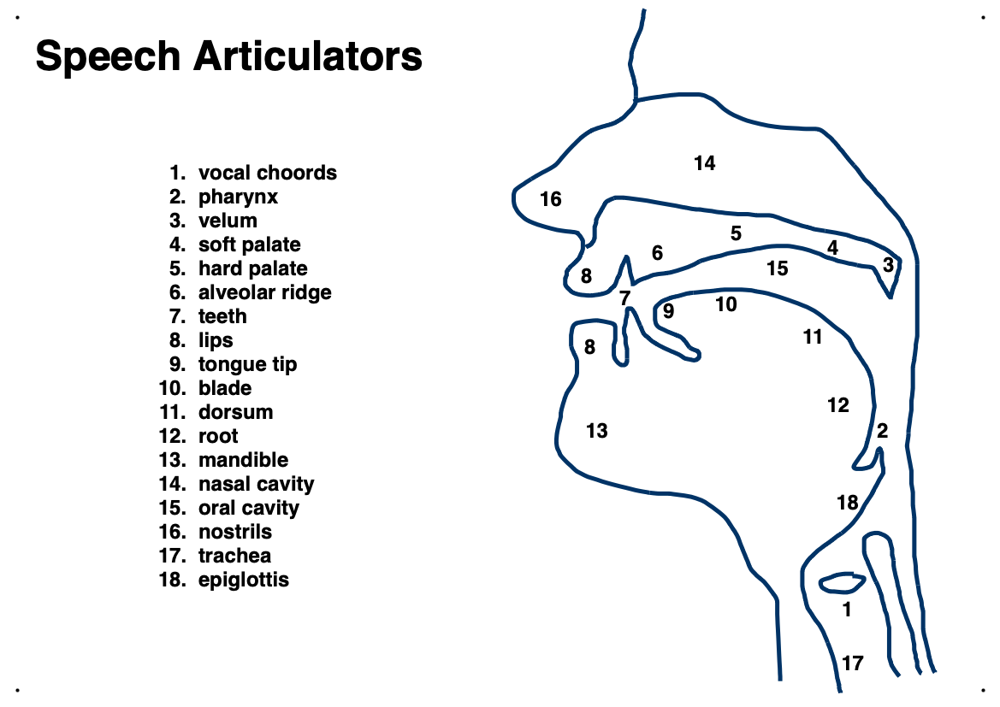

## {data-auto-animate="true" data-background-color="#DCDCDC"}

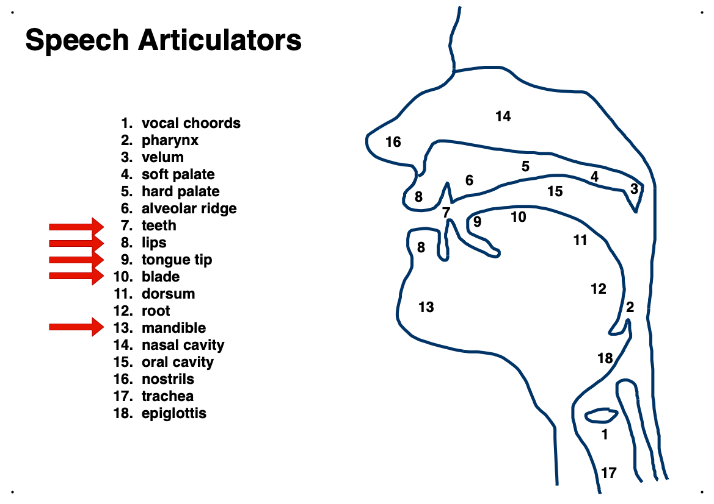

## {data-auto-animate="true" data-background-color="#DCDCDC"}

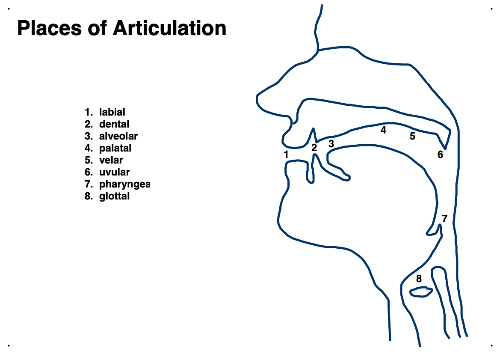

## {data-auto-animate="true" data-background-color="#DCDCDC"}

## {data-auto-animate="true" data-background-color="#DCDCDC"}

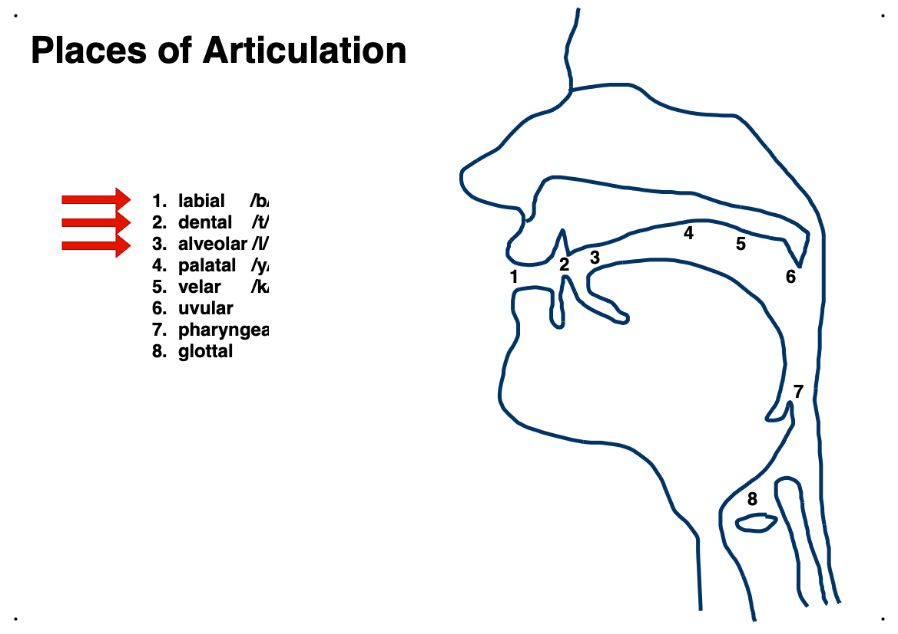

## Articulation {data-auto-animate="true"}

The **place** of articulation describes _where_ a speech sound is formed.

## Articulation {data-auto-animate="true"}

The **manner** of articulation describes _how_ a speech sound is formed.

## Articulation {data-auto-animate="true"}

- Stop
  - a complete blockage is formed along the vocal-tract.
- Nasal
  - airflow can exit through the nose (velum is lowered).
- Fricative
  - a partial blockage is formed causing a turbulent airflow.

## Articulation {data-auto-animate="true"}

- Approximant
  - a partial blockage, but insufficient enough to cause a fricative.
- Lateral
  - airflow is blocked along the centre of the vocal-tract.

**Note:** these manners of articulation are not mutually exclusive.

## Consonants {data-auto-animate="true"}

Consonants are characterised by the place and manner of articulation.

## Consonants {data-auto-animate="true"}

- _/p/_ is a voiceless bilabial stop (plosive).
- _/m/_ is a voiced bilabial nasal.
- _/f/_ is a voiceless labiodental fricative.
- _/k/_ is a voiceless velar stop.
- _/j/_ is voiced palatal lateral approximant.

## Vowels {data-auto-animate="true"}

For vowels the airflow is relatively unobstructed.

## Vowels {data-auto-animate="true"}

Vowels **cannot** be characterised by the place or manner of articulation.

## Vowels {data-auto-animate="true"}

Vowels **are** characterised by:

- The degree of lip-rounding.
- The front to back position of the high-point of the tongue.

## Vowels {data-auto-animate="true"}

Diphthongs are the _concatenation_ of two vowels.

# Visual Speech

Speech is about more than just sounds.

::: notes
The emphasis over the last few slides is this: speech is not confined to the audio domain...
speech production can be (partially) observed, and those observations can support understanding...
:::

## Visual Speech {data-auto-animate="true"}

- The formation of _some_ speech can be **seen**.
- We all use visual speech to help disambiguate similar sounds.
- In a noisy environment you tend to watch the person you are speaking with more closely.

## Visual Speech {data-auto-animate="true"}

Speech formation can be felt.

Some deaf-blind people use the **Tadoma** method of communication.

## Visual Speech {data-auto-animate="true"}

::: columns
::::: column

:::::
::::: column

:::::
:::

Can you discriminate between "dog" and "bog", in noisy audio?

## Visual Speech {data-auto-animate="true"}

::: columns
::::: column

:::::
::::: column

:::::
:::

Can you discriminate between "dog" and "bog", when the articulators are visible?

## Visual Speech {data-auto-animate="true"}

Audiovisual speech is _complementary_ in nature.

::: incremental

- Sounds that **sound** similar often look different

  eg. /b/, /d/, /m/, /n/, /f/, /s/

- The formation of sounds that **look** the same sound different

  eg. /f/, /v/, /s/, /t/, /b/, /p/

:::

## Visual Speech {data-auto-animate="true"}

Visual information provides an effective improvement of $\approx 11 dB$ in signal-to-noise ratio.

## Visual Speech {data-auto-animate="true"}

Vision can improve understanding of hard-to-understand utterances.

## Visual Speech {data-auto-animate="true"}

::: columns
::::: column
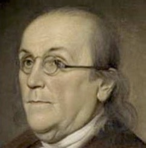
:::::
::::: column
Benjamin Franklin invented bi-focal spectacles to help better understand French!
:::::
:::

---

> "... since my being in France, the glasses that serve me best at table
> to see what I eat, not being the best to see the faces of
> those on the other side of the table who speak to me;
>
> ... and when one's ears are not well accustomed to the sounds of a
> language, a sight of the movements in the features of him that
> speaks helps to explain...
>
> so that I understand French better by the help of my spectacles."
>
> -- <cite>Benjamin Franklin, in 1785</cite>

## McGurk Effect {data-auto-animate="true"}

Visual speech can **alter** our perception of a sound.

This is illustrated by the **McGurk** effect.

<cite> McGurk & MacDonald, Hearing lips and seeing voices. 1976 </cite>

## McGurk Effect {data-auto-animate="true"}

::: columns
::::: column

<video controls loop width="340px"
    data-src="assets/mov/bagada.mp4">
</video>

:::::
::::: {.column .incremental}

- you hear "baa" ...
- you see "gaa" ...
- you perceive "daa" ...

:::::
:::

## McGurk Effect {data-auto-animate="true"}

Auditory "baa" with visual "gaa" is often perceived as "daa".

::: incremental

- What is perceived is neither seen nor heard!
- happens even when the viewer is aware of the effect
- The effect persists across age, gender and language.

:::

## McGurk Effect {data-auto-animate="true"}

<video controls loop
    data-src="assets/mov/McGurkEffect.mp4">
</video>

"baa" or "faa"?

## McGurk Effect {data-auto-animate="true"}

<video controls loop
    data-src="assets/mov/bill-pail-mayo.mp4">
</video>

"Bill", "pail", "mayo"?

## McGurk Effect {data-auto-animate="true"}

Also on YouTube:

- https://youtu.be/KiuO_Z2_AD4
- https://youtu.be/xlXaNJR-1Oo
- https://youtu.be/G-lN8vWm3m0

# Visemes

## Visemes {data-auto-animate="true"}

- The basic building block of auditory speech is the **phoneme**.
- The closest visual equivalent is the **viseme** (visual phoneme).

## Visemes {data-auto-animate="true"}

- The mapping from phonemes to visemes is **many-to-one**.
- Many phonemes map to the same viseme.

## Visemes {data-auto-animate="true"}

- Visemes are usually derived using _subjective_ experiments.
- Viewers are asked to identify the consonant in isolated nonsense words.

## Visemes {data-auto-animate="true"}

#

::: r-fit-text

Coarticulation

:::

## Coarticulation {data-auto-animate="true"}

Phonemes are abstract representations of sound.

## Coarticulation {data-auto-animate="true"}

- We could think of speech as being a string of phonemes.
- Each has an idealised articulator configuration
- Speech is produced by smoothly varying from one vocal tract configuration to the next.

## Coarticulation {data-auto-animate="true"}

::: r-fit-text

WRONG!!

:::

## Coarticulation {data-auto-animate="true"}

The articulator positions **do not** depend only on the current sound.

::: incremental

- Neighbouring sounds influence each other.

:::

## Coarticulation {data-auto-animate="true"}

The articulators never reach their _ideal_ target.

::: incremental

- They only move close enough to _approximate_ the required sound.
- What you see is a by-product of this.

:::

## Coarticulation {data-auto-animate="true"}

This is known as **coarticulation**.

## Coarticulation {data-auto-animate="true"}

There are two forms of coarticulation:

- anticipatory coarticulation
- perseverative coarticulation

::: notes
perseverative is also known as carry-over coarticulation
:::

## Coarticulation {data-auto-animate="true"}

The same phoneme in different contexts both sounds and **looks** different.

## /k/

::: columns
::::: column

<video controls width="400px"
    data-src="assets/mov/k-k-k-ken-small-cropped.mp4">
</video>

:::::
::::: {.column width=16%}

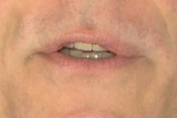
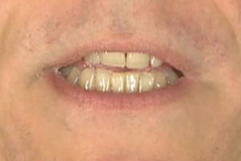
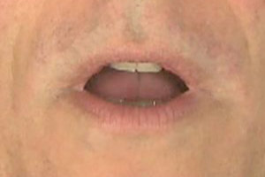
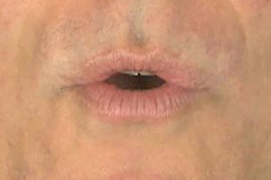
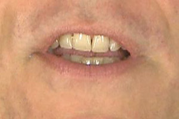

:::::
:::

## /t/

::: columns
::::: column

<video controls width="400px"
    data-src="assets/mov/t-t-t-ken-small-cropped.mp4">
</video>

:::::
::::: {.column width=16%}

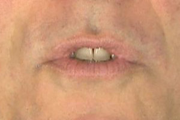
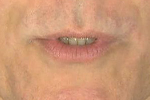
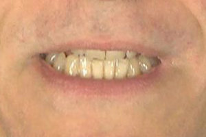
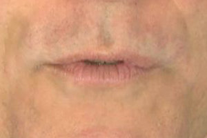

:::::
:::

## Models of Coarticulation {data-auto-animate="true"}

There is no definitive model of coarticulation.

## Look Ahead Model {data-auto-animate="true"}

One is the "Look ahead" model.

Speech gestures begin as early as possible provided there are no constraints on the articulators.

## Look Ahead Model {data-auto-animate="true" data-background-color="#DCDCDC"}

## Look Ahead Model {data-auto-animate="true"}

The look ahead model assumes lazy speech production and allows gradual transitions between speech targets.

## Temporal Model {data-auto-animate="true"}

An alternate model is the temporal model.

The temporal model assumes that speech gestures begin at a fixed time
prior to the onset of a sound.

## Temporal Model {data-auto-animate="true" data-background-color="#DCDCDC"}

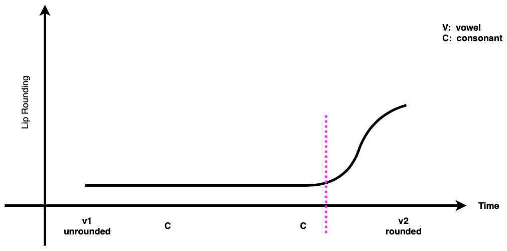

## Temporal Model {data-auto-animate="true"}

The temporal model assumes that speech gestures are largely independent and that speech is the superposition of the gestures.

## Hybrid Model {data-auto-animate="true"}

There are also hybrid models:

- Combine both the look ahead and temporal models.
- Initial movement is gradual and starts early.
- Later movement is more rapid, at a fixed time in advance of the pose.

## Gestural Model {data-auto-animate="true"}

- A phoneme is represented by a set of **dominance** functions for each articulator.
- The function specifies how dominant an articulator is at different points in time during the articulation of a sound.
- The dominance increases to a peak and then decreases over time.

## Gestural Model {data-auto-animate="true" data-background-color="#DCDCDC"}

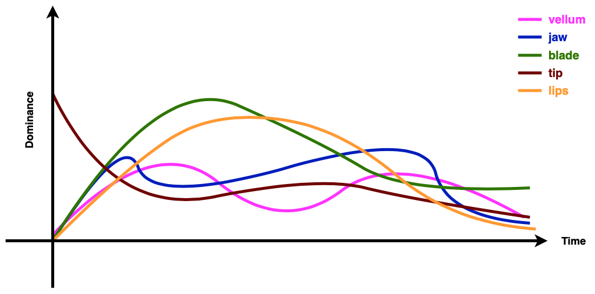

## Models of Coarticulation {data-auto-animate="true"}

- Different coarticulation models exist because different studies use different experimental conditions and linguistic factors.
- Each model might fit the particular conditions for a given experiment.
- The lack of a formal definition of a viseme and a definitive model of coarticulation make recognition (and synthesis) of visual speech difficult!

# Summary

Speech is multi-modal in nature!

## Summary {data-auto-animate="true"}

A view of the articulation is useful for disambiguating similar sounds.

To a limited extent we all _lip-read_ regardless of our awareness.

## Summary {data-auto-animate="true"}

Visual speech is poorly defined compared with acoustic speech.

- A viseme is assumed to be the visual analogue of the phoneme.
- Coarticulation means that visemes as lip shapes are not a good unit.
- The same sound has many different visual appearances.
